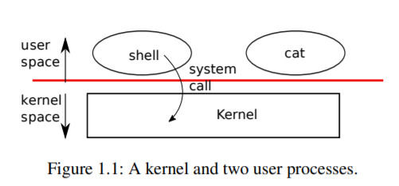
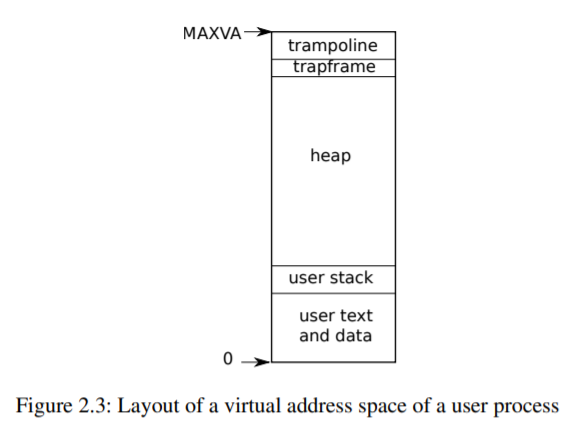
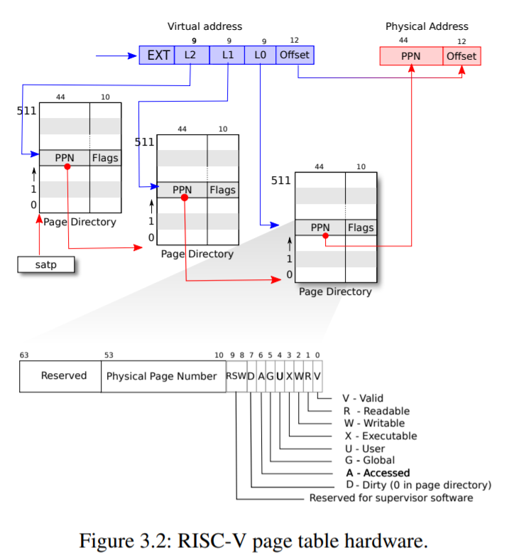
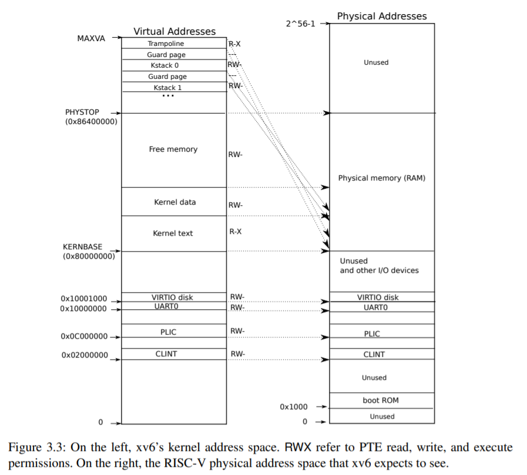

### xv6: a simple, Unix-like teaching operating system

Russ Cox Frans Kaashoek Robert Morris

October 27, 2019


## Contents


- 1 Operating system interfaces
   - 1.1 Processes and memory
   - 1.2 I/O and File descriptors
   - 1.3 Pipes
   - 1.4 File system
   - 1.5 Real world
   - 1.6 Exercises
- 2 Operating system organization
   - 2.1 Abstracting physical resources
   - 2.2 User mode, supervisor mode, and system calls
   - 2.3 Kernel organization
   - 2.4 Code: xv6 organization
   - 2.5 Process overview
   - 2.6 Code: starting xv6 and the first process
   - 2.7 Real world
   - 2.8 Exercises
- 3 Page tables
   - 3.1 Paging hardware
   - 3.2 Kernel address space
   - 3.3 Code: creating an address space
   - 3.4 Physical memory allocation
   - 3.5 Code: Physical memory allocator
   - 3.6 Process address space
   - 3.7 Code: sbrk
   - 3.8 Code: exec
   - 3.9 Real world
   - 3.10 Exercises
- 4 Traps and device drivers
   - 4.1 RISC-V trap machinery
   - 4.2 Traps from kernel space
   - 4.3 Traps from user space
   - 4.4 Timer interrupts
   - 4.5 Code: Calling system calls
   - 4.6 Code: System call arguments
   - 4.7 Device drivers
   - 4.8 Code: The console driver
   - 4.9 Real world
   - 4.10 Exercises
- 5 Locking
   - 5.1 Race conditions
   - 5.2 Code: Locks
   - 5.3 Code: Using locks
   - 5.4 Deadlock and lock ordering
   - 5.5 Locks and interrupt handlers
   - 5.6 Instruction and memory ordering
   - 5.7 Sleep locks
   - 5.8 Real world
   - 5.9 Exercises
- 6 Scheduling
   - 6.1 Multiplexing
   - 6.2 Code: Context switching
   - 6.3 Code: Scheduling
   - 6.4 Code: mycpu and myproc
   - 6.5 Sleep and wakeup
   - 6.6 Code: Sleep and wakeup
   - 6.7 Code: Pipes
   - 6.8 Code: Wait, exit, and kill
   - 6.9 Real world
   - 6.10 Exercises
- 7 File system
   - 7.1 Overview
   - 7.2 Buffer cache layer
   - 7.3 Code: Buffer cache
   - 7.4 Logging layer
   - 7.5 Log design
   - 7.6 Code: logging
   - 7.7 Code: Block allocator
   - 7.8 Inode layer
   - 7.9 Code: Inodes
   - 7.10 Code: Inode content
   - 7.11 Code: directory layer
   - 7.12 Code: Path names
   - 7.13 File descriptor layer
   - 7.14 Code: System calls
   - 7.15 Real world
   - 7.16 Exercises
- 8 Concurrency revisited
   - 8.1 Locking patterns
   - 8.2 Lock-like patterns
   - 8.3 No locks at all
   - 8.4 Parallelism
   - 8.5 Exercises
- 9 Summary


# Foreword and acknowledgements

This is a draft text intended for a class on operating systems. It explains the main concepts of operating systems by studying an example kernel, named xv6. xv6 is a re-implementation of Dennis
Ritchie’s and Ken Thompson’s Unix Version 6 (v6) [10]. xv6 loosely follows the structure and style of v6, but is implemented in ANSI C [5] for a multicore RISC-V [9].

This text should be read along with the source code for xv6, an approach inspired by John Lions’s Commentary on UNIX 6th Edition [7]. See https://pdos.csail.mit.edu/6.828 for pointers to on-line resources for v6 and xv6, including several hands-on homework assignments using xv6.

We have used this text in 6.828, the operating systems class at MIT. We thank the faculty, teaching assistants, and students of 6.828 who have all directly or indirectly contributed to xv6.
In particular, we would like to thank Austin Clements and Nickolai Zeldovich. Finally, we would like to thank people who emailed us bugs in the text or suggestions for improvements: Abutalib,Aghayev, Sebastian Boehm, Anton Burtsev, Raphael Carvalho, Tej Chajed, Rasit Eskicioglu, Color Fuzzy, Giuseppe, Tao Guo, Robert Hilderman, Wolfgang Keller, Austin Liew, Pavan Maddamsetti, Jacek Masiulaniec, Michael McConville, miguelgvieira, Mark Morrissey, Harry Pan, Askar Safin,
Salman Shah, Ruslan Savchenko, Pawel Szczurko, Warren Toomey, tyfkda, tzerbib, Xi Wang, and Zou Chang Wei.

If you spot errors or have suggestions for improvement, please send email to Frans Kaashoek
and Robert Morris (kaashoek,rtm@csail.mit.edu).

# Chapter 1

# Operating system interfaces

The job of an operating system is to share a computer among multiple programs and to provide a more useful set of services than the hardware alone supports. The operating system manages
and abstracts the low-level hardware, so that, for example, a word processor need not concern itself with which type of disk hardware is being used. It also shares the hardware among multiple programs so that they run (or appear to run) at the same time. Finally, operating systems provide controlled ways for programs to interact, so that they can share data or work together.

An operating system provides services to user programs through an interface. Designing a good interface turns out to be difficult. On the one hand, we would like the interface to be simple and narrow because that makes it easier to get the implementation right. On the other hand, we may be tempted to offer many sophisticated features to applications. The trick in resolving this tension is to design interfaces that rely on a few mechanisms that can be combined to provide much generality.

This book uses a single operating system as a concrete example to illustrate operating system concepts. That operating system, xv6, provides the basic interfaces introduced by Ken Thompson
and Dennis Ritchie’s Unix operating system [10], as well as mimicking Unix’s internal design. Unix provides a narrow interface whose mechanisms combine well, offering a surprising degree of generality. This interface has been so successful that modern operating systems—BSD, Linux, Mac OS X, Solaris, and even, to a lesser extent, Microsoft Windows—have Unix-like interfaces. Understanding xv6 is a good start toward understanding any of these systems and many others.

As shown in Figure 1.1, xv6 takes the traditional form of akernel, a special program that provides services to running programs. Each running program, called aprocess, has memory containing instructions, data, and a stack. The instructions implement the program’s computation. The data are the variables on which the computation acts. The stack organizes the program’s procedure
calls.

When a process needs to invoke a kernel service, it invokes a procedure call in the operating system interface. Such a procedure is called asystem call. The system call enters the kernel; the
kernel performs the service and returns. Thus a process alternates between executing inuser space and kernel space.

The kernel uses the CPU’s hardware protection mechanisms to ensure that each process executing in user space can access only its own memory. The kernel executes with the hardware privileges
required to implement these protections; user programs execute without those privileges. When a user program invokes a system call, the hardware raises the privilege level and starts executing a pre-arranged function in the kernel.




The collection of system calls that a kernel provides is the interface that user programs see. The xv6 kernel provides a subset of the services and system calls that Unix kernels traditionally offer. Figure 1.2 lists all of xv6’s system calls.

The rest of this chapter outlines xv6’s services—processes, memory, file descriptors, pipes, and a file system—and illustrates them with code snippets and discussions of how theshell, which is
the primary user interface to traditional Unix-like systems, uses them. The shell’s use of system calls illustrates how carefully they have been designed.

The shell is an ordinary program that reads commands from the user and executes them. The fact that the shell is a user program and not part of the kernel, illustrates the power of the system
call interface: there is nothing special about the shell. It also means that the shell is easy to replace; as a result, modern Unix systems have a variety of shells to choose from, each with its own user interface and scripting features. The xv6 shell is a simple implementation of the essence of the Unix Bourne shell. Its implementation can be found at(user/sh.c:1).

### 1.1 Processes and memory

An xv6 process consists of user-space memory (instructions, data, and stack) and per-process state private to the kernel. Xv6 cantime-shareprocesses: it transparently switches the available CPUs among the set of processes waiting to execute. When a process is not executing, xv6 saves its CPU registers, restoring them when it next runs the process. The kernel associates a process identifier,
orpid, with each process.

A process may create a new process using theforksystem call.Forkcreates a new process, called thechild process, with exactly the same memory contents as the calling process, called the parent process.Forkreturns in both the parent and the child. In the parent,forkreturns the child’s
pid; in the child, it returns zero. For example, consider the following program fragment written in the C programming language [5]:

```c
int pid = fork();
if(pid > 0){
  printf("parent: child=%d\en", pid);
  pid = wait(0);
  printf("child %d is done\en", pid);
} else if(pid == 0){
  printf("child: exiting\en");
  exit(0);
} else {
  printf("fork error\en");
}
```

System call          | Description
---------------------|-----------------------------
fork()               | Create a process
exit(xstatus)        | Terminate the current process with xstatus indicating success of failure
wait(*xstatus)       | Wait for a child process to exit and copy the child’s exit status to xstatus
kill(pid)            | Terminate process pid
getpid()             | Return the current process’s pid
sleep(n)             | Sleep for n clock ticks
exec(filename, *argv)| Load a file and execute it
sbrk(n)              | Grow process’s memory by n bytes
open(filename, flags)| Open a file; the flags indicate read/write
read(fd, buf, n)     | Read n bytes from an open file into buf
write(fd, buf, n)    | Write n bytes to an open file
close(fd)            | Release open file fd
dup(fd)              | Duplicate fd
pipe(p)              | Create a pipe and return fd’s in p
chdir(dirname)       | Change the current directory
mkdir(dirname)       | Create a new directory
mknod(name, major, minor) | Create a device file
fstat(fd)            | Return info about an open file
link(f1, f2)         | Create another name (f2) for the file f
unlink(filename)     | Remove a file

> Figure 1.2: Xv6 system calls

The exit system call causes the calling process to stop executing and to release resources such as memory and open files. Exit takes an integer status argument, conventionally 0 to indicate success
and 1 to indicate failure. Thewaitsystem call returns the pid of an exited child of the current process and copies the exit status of the child to the address passed to wait; if none of the caller’s
children has exited,waitwaits for one to do so. If the parent doesn’t care about the exit status of a child, it can pass a 0 address towait.
In the example, the output lines 

```
parent: child=
child: exiting
```

might come out in either order, depending on whether the parent or child gets to itsprintfcall first. After the child exits the parent’swaitreturns, causing the parent to print

```
parent: child 1234 is done
```

Although the child has the same memory contents as the parent initially, the parent and child are executing with different memory and different registers: changing a variable in one does not affect the other. For example, when the return value ofwaitis stored intopidin the parent process, it doesn’t change the variablepidin the child. The value ofpidin the child will still be zero.

The exec system call replaces the calling process’s memory with a new memory image loaded from a file stored in the file system. The file must have a particular format, which specifies which part of the file holds instructions, which part is data, at which instruction to start, etc. xv6 uses the ELF format, which Chapter 3 discusses in more detail. Whenexecsucceeds, it does not return to the calling program; instead, the instructions loaded from the file start executing at the entry
point declared in the ELF header.Exectakes two arguments: the name of the file containing the executable and an array of string arguments. For example:

```
char *argv[3];

argv[0] = "echo";
argv[1] = "hello";
argv[2] = 0;
exec("/bin/echo", argv);
printf("exec error\en");
```

This fragment replaces the calling program with an instance of the program/bin/echorunning with the argument listecho hello. Most programs ignore the first argument, which is conventionally the name of the program.

The xv6 shell uses the above calls to run programs on behalf of users. The main structure of the shell is simple; see main(user/sh.c:145). The main loop reads a line of input from the user with getcmd. Then it callsfork, which creates a copy of the shell process. The parent callswait, while the child runs the command. For example, if the user had typed “echo hello” to the shell, runcmd would have been called with “echo hello” as the argument.runcmd(user/sh.c:58) runs the actual command. For “echo hello”, it would callexec(user/sh.c:78). Ifexecsucceeds then the child will execute instructions fromechoinstead ofruncmd. At some pointechowill call exit, which will cause the parent to return fromwaitinmain(user/sh.c:145).

You might wonder whyforkandexecare not combined in a single call; we will see later that separate calls for creating a process and loading a program has some clever usages in the shell for I/O redirection. To avoid the wastefulness of creating a duplicate process and then immediately replacing it, operating kernels optimize the implementation offorkfor this use case by using virtual memory techniques such as copy-on-write.

Xv6 allocates most user-space memory implicitly:forkallocates the memory required for the child’s copy of the parent’s memory, andexecallocates enough memory to hold the executable file. A process that needs more memory at run-time (perhaps formalloc) can callsbrk(n)to
grow its data memory bynbytes;sbrkreturns the location of the new memory.

Xv6 does not provide a notion of users or of protecting one user from another; in Unix terms, all xv6 processes run as root.


### 1.2 I/O and File descriptors

Afile descriptoris a small integer representing a kernel-managed object that a process may read from or write to. A process may obtain a file descriptor by opening a file, directory, or device, or by creating a pipe, or by duplicating an existing descriptor. For simplicity we’ll often refer to the object a file descriptor refers to as a “file”; the file descriptor interface abstracts away the differences between files, pipes, and devices, making them all look like streams of bytes.
Internally, the xv6 kernel uses the file descriptor as an index into a per-process table, so that every process has a private space of file descriptors starting at zero. By convention, a process reads from file descriptor 0 (standard input), writes output to file descriptor 1 (standard output), and writes error messages to file descriptor 2 (standard error). As we will see, the shell exploits the convention to implement I/O redirection and pipelines. The shell ensures that it always has three file descriptors open(user/sh.c:151), which are by default file descriptors for the console.

The read and write system calls read bytes from and write bytes to open files named by file descriptors. The callread(fd,buf,n)reads at mostnbytes from the file descriptorfd, copies them intobuf, and returns the number of bytes read. Each file descriptor that refers to a file has an offset associated with it.Readreads data from the current file offset and then advances that offset by the number of bytes read: a subsequentreadwill return the bytes following the ones returned by the firstread. When there are no more bytes to read,readreturns zero to indicate the end of the file.

The call write(fd,buf,n) writes nbytes frombufto the file descriptorfdand returns the number of bytes written. Fewer thannbytes are written only when an error occurs. Likeread, writewrites data at the current file offset and then advances that offset by the number of bytes written: eachwritepicks up where the previous one left off.

The following program fragment (which forms the essence of the program cat) copies data from its standard input to its standard output. If an error occurs, it writes a message to the standard error.

```c
char buf[512];
int n;

for(;;) {
  n = read(0, buf, sizeof buf);
  if(n == 0)
    break;
  if(n < 0){
    fprintf(2, "read error\en");
    exit();
  }
  if(write(1, buf, n) != n){
    fprintf(2, "write error\en");
    exit();
  }
}
```

The important thing to note in the code fragment is thatcatdoesn’t know whether it is reading from a file, console, or a pipe. Similarly cat doesn’t know whether it is printing to a console, a file, or whatever. The use of file descriptors and the convention that file descriptor 0 is input and file descriptor 1 is output allows a simple implementation of cat.

The close system call releases a file descriptor, making it free for reuse by a future open, pipe, ordupsystem call (see below). A newly allocated file descriptor is always the lowest-numbered unused descriptor of the current process.

File descriptors andforkinteract to make I/O redirection easy to implement.Forkcopies the parent’s file descriptor table along with its memory, so that the child starts with exactly the same open files as the parent. The system callexecreplaces the calling process’s memory but preserves its file table. This behavior allows the shell to implement I/O redirection by forking, reopening chosen file descriptors, and then execing the new program. Here is a simplified version of the code a shell runs for the command `cat < input.txt`:

```
char *argv[2];

argv[0] = "cat";
argv[1] = 0;
if(fork() == 0) {
  close(0);
  open("input.txt", O_RDONLY);
  exec("cat", argv);
}
```

After the child closes file descriptor 0,openis guaranteed to use that file descriptor for the newly openedinput.txt: 0 will be the smallest available file descriptor.Cat then executes with file descriptor 0 (standard input) referring toinput.txt.

The code for I/O redirection in the xv6 shell works in exactly this way(user/sh.c:82). Recall that at this point in the code the shell has already forked the child shell and that runcmd will call exec to load the new program. Now it should be clear why it is a good idea that fork and exec are separate calls. Because if they are separate, the shell can fork a child, useopen,close,dup in the child to change the standard input and output file descriptors, and thenexec. No changes to the program being exec-ed (catin our example) are required. If fork and exec were combined into a single system call, some other (probably more complex) scheme would be required for the shell to redirect standard input and output, or the program itself would have to understand how to
redirect I/O.

Although fork copies the file descriptor table, each underlying file offset is shared between parent and child. Consider this example:

```
if(fork() == 0) {
  write(1, "hello ", 6);
  exit(0);
} else {
  wait(0);
  write(1, "world\en", 6);
}
```

At the end of this fragment, the file attached to file descriptor 1 will contain the data hello world. The write in the parent (which, thanks towait, runs only after the child is done) picks up where
the child’swriteleft off. This behavior helps produce sequential output from sequences of shell commands, like (echo hello;echo world) >output.txt. 

The dup system call duplicates an existing file descriptor, returning a new one that refers to the same underlying I/O object. Both file descriptors share an offset, just as the file descriptors
duplicated by fork do. This is another way to write hello world into a file:

```c
fd = dup(1);
write(1, "hello ", 6);
write(fd, "world\en", 6);
```

Two file descriptors share an offset if they were derived from the same original file descriptor by a sequence offorkanddupcalls. Otherwise file descriptors do not share offsets, even if they resulted fromopencalls for the same file.Dupallows shells to implement commands like this: ls existing-file non-existing-file > tmp1 2>&1. The2>&1tells the shell to give the command a file descriptor 2 that is a duplicate of descriptor 1. Both the name of the existing file and the error message for the non-existing file will show up in the filetmp1. The xv6 shell doesn’t support I/O redirection for the error file descriptor, but now you know how to implement it.

File descriptors are a powerful abstraction, because they hide the details of what they are connected to: a process writing to file descriptor 1 may be writing to a file, to a device like the console,
or to a pipe.

### 1.3 Pipes

Apipeis a small kernel buffer exposed to processes as a pair of file descriptors, one for reading and one for writing. Writing data to one end of the pipe makes that data available for reading from the other end of the pipe. Pipes provide a way for processes to communicate.
The following example code runs the programwcwith standard input connected to the read end of a pipe.

```c
int p[2];
char *argv[2];

argv[0] = "wc";
argv[1] = 0;

pipe(p);
if(fork() == 0) {
  close(0);
  dup(p[0]);
  close(p[0]);
  close(p[1]);
  exec("/bin/wc", argv);
} else {
  close(p[0]);
  write(p[1], "hello world\en", 12);
  close(p[1]);
}
```

The program callspipe, which creates a new pipe and records the read and write file descriptors in the arrayp. Afterfork, both parent and child have file descriptors referring to the pipe. The child dups the read end onto file descriptor 0, closes the file descriptors inp, and execswc. When wcreads from its standard input, it reads from the pipe. The parent closes the read side of the pipe, writes to the pipe, and then closes the write side.

If no data is available, a `read` on a pipe waits for either data to be written or all file descriptors referring to the write end to be closed; in the latter case,readwill return 0, just as if the end of a data file had been reached. The fact thatreadblocks until it is impossible for new data to arrive is one reason that it’s important for the child to close the write end of the pipe before executing wcabove: if one ofwc’s file descriptors referred to the write end of the pipe,wcwould never see end-of-file.

The xv6 shell implements pipelines such asgrep fork sh.c | wc -lin a manner similar to the above code(user/sh.c:100). The child process creates a pipe to connect the left end of the pipeline with the right end. Then it callsforkandruncmdfor the left end of the pipeline and
forkandruncmdfor the right end, and waits for both to finish. The right end of the pipeline may be a command that itself includes a pipe (e.g.,a | b | c), which itself forks two new child processes (one forband one forc). Thus, the shell may create a tree of processes. The leaves
of this tree are commands and the interior nodes are processes that wait until the left and right children complete. In principle, you could have the interior nodes run the left end of a pipeline, but
doing so correctly would complicate the implementation.

Pipes may seem no more powerful than temporary files: the pipeline

```
echo hello world | wc
```

could be implemented without pipes as

```
echo hello world >/tmp/xyz; wc </tmp/xyz
```

Pipes have at least four advantages over temporary files in this situation. First, pipes automatically clean themselves up; with the file redirection, a shell would have to be careful to remove/tmp/xyz
when done. Second, pipes can pass arbitrarily long streams of data, while file redirection requires enough free space on disk to store all the data. Third, pipes allow for parallel execution of pipeline
stages, while the file approach requires the first program to finish before the second starts. Fourth, if you are implementing inter-process communication, pipes’ blocking reads and writes are more efficient than the non-blocking semantics of files.

### 1.4 File system

The xv6 file system provides data files, which are uninterpreted byte arrays, and directories, which contain named references to data files and other directories. The directories form a tree, starting at

a special directory called theroot. Apathlike/a/b/crefers to the file or directory namedcinside the directory namedbinside the directory namedain the root directory/. Paths that don’t begin with/are evaluated relative to the calling process’scurrent directory, which can be changed with thechdirsystem call. Both these code fragments open the same file (assuming all the directories involved exist):

```c
chdir("/a");
chdir("b");
open("c", O_RDONLY);

open("/a/b/c", O_RDONLY);
```

The first fragment changes the process’s current directory to/a/b; the second neither refers to nor changes the process’s current directory.
There are multiple system calls to create a new file or directory:mkdircreates a new directory, openwith theO_CREATEflag creates a new data file, andmknodcreates a new device file. This
example illustrates all three:

```c
mkdir("/dir");
fd = open("/dir/file", O_CREATE|O_WRONLY);
close(fd);
mknod("/console", 1, 1);
```
Mknod creates a file in the file system, but the file has no contents. Instead, the file’s metadata marks it as a device file and records the major and minor device numbers (the two arguments to mknod), which uniquely identify a kernel device. When a process later opens the file, the kernel divertsreadandwritesystem calls to the kernel device implementation instead of passing them to the file system.
Fstatretrieves information about the object a file descriptor refers to. It fills in astruct stat, defined instat.h(kernel/stat.h)as:

```c
#define T_DIR 1 // Directory
#define T_FILE 2 // File
#define T_DEVICE 3 // Device

struct stat {
  int dev; // File system’s disk device
  uint ino; // Inode number
  short type; // Type of file
  short nlink; // Number of links to file
  uint64 size; // Size of file in bytes
};
```

A file’s name is distinct from the file itself; the same underlying file, called aninode, can have multiple names, calledlinks. Thelinksystem call creates another file system name referring to
the same inode as an existing file. This fragment creates a new file named both a and b.

```c
open("a", O_CREATE|O_WRONLY);
link("a", "b");
```

Reading from or writing toais the same as reading from or writing tob. Each inode is identified by a uniqueinode number. After the code sequence above, it is possible to determine that a and b refer to the same underlying contents by inspecting the result offstat: both will return the same inode number (ino), and thenlinkcount will be set to 2.
Theunlinksystem call removes a name from the file system. The file’s inode and the disk space holding its content are only freed when the file’s link count is zero and no file descriptors refer to it. Thus adding

```c
unlink("a");
```
to the last code sequence leaves the inode and file content accessible as b. Further more,

```c
fd = open("/tmp/xyz", O_CREATE|O_RDWR);
unlink("/tmp/xyz");
```

is an idiomatic way to create a temporary inode that will be cleaned up when the process closesfd or exits.

Shell commands for file system operations are implemented as user-level programs such as mkdir,ln,rm, etc. This design allows anyone to extend the shell with new user commands by just adding a new user-level program. In hindsight this plan seems obvious, but other systems designed at the time of Unix often built such commands into the shell (and built the shell into the kernel).

One exception iscd, which is built into the shell(user/sh.c:160).cdmust change the current working directory of the shell itself. Ifcdwere run as a regular command, then the shell would fork a child process, the child process would runcd, andcdwould change thechild’s working
directory. The parent’s (i.e., the shell’s) working directory would not change.

### 1.5 Real world

Unix’s combination of “standard” file descriptors, pipes, and convenient shell syntax for operations on them was a major advance in writing general-purpose reusable programs. The idea sparked a
whole culture of “software tools” that was responsible for much of Unix’s power and popularity, and the shell was the first so-called “scripting language.” The Unix system call interface persists
today in systems like BSD, Linux, and Mac OS X.

The Unix system call interface has been standardized through the Portable Operating System Interface (POSIX) standard. Xv6 isnotPOSIX compliant. It misses system calls (including basic
ones such aslseek), it implements system calls only partially, as well as other differences. Our main goals for xv6 are simplicity and clarity while providing a simple UNIX-like system-call interface. Several people have extended xv6 with a few more system calls and a simple C library in order to run basic Unix programs. Modern kernels, however, provide many more system calls, and many more kinds of kernel services, than xv6. For example, they support networking, windowing systems, user-level threads, drivers for many devices, and so on. Modern kernels evolve continuously and rapidly, and offer many features beyond POSIX.

For the most part, modern Unix-derived operating systems have not followed the early Unix model of exposing devices as special files, like the console device file discussed above. The authors of Unix went on to build Plan 9, which applied the “resources are files” concept to modern facilities, representing networks, graphics, and other resources as files or file trees. The file system and file descriptors have been powerful abstractions. Even so, there are other models for operating system interfaces. Multics, a predecessor of Unix, abstracted file storage in a way that made it look like memory, producing a very different flavor of interface. The complexity of the Multics design had a direct influence on the designers of Unix, who tried to build something simpler.

This book examines how xv6 implements its Unix-like interface, but the ideas and concepts apply to more than just Unix. Any operating system must multiplex processes onto the underlying hardware, isolate processes from each other, and provide mechanisms for controlled inter-process communication. After studying xv6, you should be able to look at other, more complex operating systems and see the concepts underlying xv6 in those systems as well.

### 1.6 Exercises

1. Write a program that uses UNIX system calls to “ping-pong” a byte between two processes over a pair of pipes, one for each direction. Measure the program’s performance, in exchanges per second.

# Chapter 2

# Operating system organization

A key requirement for an operating system is to support several activities at once. For example, using the system call interface described in chapter 1 a process can start new processes withfork.
The operating system musttime-sharethe resources of the computer among these processes. For example, even if there are more processes than there are hardware CPUs, the operating system must ensure that all of the processes make progress. The operating system must also arrange forisolation between the processes. That is, if one process has a bug and fails, it shouldn’t affect processes that don’t depend on the failed process. Complete isolation, however, is too strong, since it should be possible for processes to intentionally interact; pipelines are an example. Thus an operating system must fulfill three requirements: multiplexing, isolation, and interaction.

This chapter provides an overview of how operating systems are organized to achieve these three requirements. It turns out there are many ways to do so, but this text focuses on mainstream designs centered around amonolithic kernel, which is used by many Unix operating systems. This chapter also provides an overview of an xv6 process, which is the unit of isolation in xv6, and the creation of the first process when xv6 starts running.

Xv6 runs on multi-core RISC-V microprocessor, and much of its low-level functionality (for example, its process implementation) is specific to RISC-V. RISC-V is a 64-bit CPU, and xv6 is written in “LP64” C, which means long (L) and pointers (P) in the C programming language are 64
bits, but int is 32-bit. This book assumes the reader has done a bit of machine-level programming on some architecture, and will introduce RISC-V-specific ideas as they come up. A useful reference for RISC-V is “The RISC-V Reader: An Open Architecture Atlas” [9]. The user-level ISA [2] and the privileged architecture [1] are the official specifications.
This text generally refers to the hardware element that executes a computation with the term CPU, an acronym for central processing unit. Other documentation (e.g., the RISC-V specification) also uses the words processor, core, and hart instead of CPU. Xv6 expects multi-core RISC-V hardware; that is, multiple CPUs that share memory but execute independent programs in parallel.

This text sometimes uses the termmultiprocessoras a synonym for multi-core, though the former term can also refer to a computer board with several distinct processor chips.

The CPU in a complete computer is surrounded by support hardware, much of it in the form of I/O interfaces. Xv6 is written for the support hardware simulated by qemu’s “-machine virt” option. This includes RAM, a ROM containing boot code, a serial connection to the user’s keyboard/screen, and a disk for storage.

### 2.1 Abstracting physical resources

The first question one might ask when encountering an operating system is why have it at all? That is, one could implement the system calls in Figure 1.2 as a library, with which applications link. In this plan, each application could even have its own library tailored to its needs. Applications could directly interact with hardware resources and use those resources in the best way for the application (e.g., to achieve high or predictable performance). Some operating systems for embedded devices or real-time systems are organized in this way.

The downside of this library approach is that, if there is more than one application running, the applications must be well-behaved. For example, each application must periodically give up the CPU so that other applications can run. Such acooperativetime-sharing scheme may be OK if all applications trust each other and have no bugs. It’s more typical for applications to not trust each other, and to have bugs, so one often wants stronger isolation than a cooperative scheme provides.

To achieve strong isolation it’s helpful to forbid applications from directly accessing sensitive hardware resources, and instead to abstract the resources into services. For example, applications
interact with a file system only throughopen,read,write, andclosesystem calls, instead of reading and writing raw disk sectors. This provides the application with the convenience of pathnames, and it allows the operating system (as the implementer of the interface) to manage the
disk.

Similarly, Unix transparently switches hardware CPUs among processes, saving and restoring register state as necessary, so that applications don’t have to be aware of time sharing. This transparency allows the operating system to share CPUs even if some applications are in infinite
loops.

As another example, Unix processes useexecto build up their memory image, instead of directly interacting with physical memory. This allows the operating system to decide where to place a process in memory; if memory is tight, the operating system might even store some of a process’s data on disk.Execalso provides users with the convenience of a file system to store executable program images.

Many forms of interaction among Unix processes occur via file descriptors. Not only do file descriptors abstract away many details (e.g., where data in a pipe or file is stored), they are also defined in a way that simplifies interaction. For example, if one application in a pipeline fails, the kernel generates an end-of-file signal for the next process in the pipeline.

As you can see, the system-call interface in Figure 1.2 is carefully designed to provide both programmer convenience and the possibility of strong isolation. The Unix interface is not the only way to abstract resources, but it has proven to be a very good one.


### 2.2 User mode, supervisor mode, and system calls

Strong isolation requires a hard boundary between applications and the operating system. If the application makes a mistake, we don’t want the operating system to fail or other applications to fail. Instead, the operating system should be able to clean up the failed application and continue running other applications. To achieve strong isolation, the operating system must arrange that applications cannot modify (or even read) the operating system’s data structures and instructions and that applications cannot access other processes’ memory.

CPUs provide hardware support for strong isolation. For example, RISC-V has three modes in which the CPU can execute instructions:machine mode,supervisor mode, anduser mode. Instructions executing in machine mode have full privilege; a CPU starts in machine mode. Machine mode is mostly intended for configuring a computer. Xv6 executes a few lines in machine mode and then changes to supervisor mode.

In supervisor mode the CPU is allowed to executeprivileged instructions: for example, enabling and disabling interrupts, reading and writing the register that holds the address of a page table, etc. If an application in user mode attempts to execute a privileged instruction, then the CPU doesn’t execute the instruction, but switches to supervisor mode so that supervisor-mode code can terminate the application, because it did something it shouldn’t be doing. Figure 1.1 in Chapter 1 illustrates this organization. An application can execute only user-mode instructions (e.g., adding numbers, etc.) and is said to be running inuser space, while the software in supervisor mode can
also execute privileged instructions and is said to be running inkernel space. The software running in kernel space (or in supervisor mode) is called thekernel.
An application that wants to invoke a kernel function (e.g., thereadsystem call in xv6) must transition to the kernel. CPUs provide a special instruction that switches the CPU from user mode to supervisor mode and enters the kernel at an entry point specified by the kernel. (RISC-V provides theecallinstruction for this purpose.) Once the CPU has switched to supervisor mode, the kernel can then validate the arguments of the system call, decide whether the application is allowed to perform the requested operation, and then deny it or execute it. It is important that the kernel control the entry point for transitions to supervisor mode; if the application could decide the kernel entry point, a malicious application could, for example, enter the kernel at a point where the validation of arguments is skipped.

### 2.3 Kernel organization

A key design question is what part of the operating system should run in supervisor mode. One possibility is that the entire operating system resides in the kernel, so that the implementations of all system calls run in supervisor mode. This organization is called amonolithic kernel.
In this organization the entire operating system runs with full hardware privilege. This organization is convenient because the OS designer doesn’t have to decide which part of the operating system doesn’t need full hardware privilege. Furthermore, it easy for different parts of the operating system to cooperate. For example, an operating system might have a buffer cache that can be shared both by the file system and the virtual memory system.


A downside of the monolithic organization is that the interfaces between different parts of the operating system are often complex (as we will see in the rest of this text), and therefore it is easy for an operating system developer to make a mistake. In a monolithic kernel, a mistake is fatal, because an error in supervisor mode will often cause the kernel to fail. If the kernel fails, the computer stops working, and thus all applications fail too. The computer must reboot to start
again.

To reduce the risk of mistakes in the kernel, OS designers can minimize the amount of operating system code that runs in supervisor mode, and execute the bulk of the operating system in user mode. This kernel organization is called amicrokernel.

Figure 2.1 illustrates this microkernel design. In the figure, the file system runs as a user-level process. OS services running as processes are called servers. To allow applications to interact with the file server, the kernel provides an inter-process communication mechanism to send messages from one user-mode process to another. For example, if an application like the shell wants to read or write a file, it sends a message to the file server and waits for a response.

In a microkernel, the kernel interface consists of a few low-level functions for starting applications, sending messages, accessing device hardware, etc. This organization allows the kernel to be relatively simple, as most of the operating system resides in user-level servers.
Xv6 is implemented as a monolithic kernel, like most Unix operating systems. Thus, the xv6 kernel interface corresponds to the operating system interface, and the kernel implements the complete operating system. Since xv6 doesn’t provide many services, its kernel is smaller than some microkernels, but conceptually xv6 is monolithic.

### 2.4 Code: xv6 organization

The xv6 kernel source is in thekernel/sub-directory. The source is divided into files, following a rough notion of modularity; Figure 2.2 lists the files. The interface for each module is defined in
defs.h(kernel/defs.h).

### 2.5 Process overview

The unit of isolation in xv6 (as in other Unix operating systems) is aprocess. The process abstraction prevents one process from wrecking or spying on another process’s memory, CPU, file descriptors, etc. It also prevents a process from wrecking the kernel itself, so that a process can’t subvert the kernel’s isolation mechanisms. The kernel must implement the process abstraction with care because a buggy or malicious application may trick the kernel or hardware into doing something bad (e.g., circumventing isolation). The mechanisms used by the kernel to implement processes include the user/supervisor mode flag, address spaces, and time-slicing of threads.

File          | Description
--------------|-------------------------------------------
bio.c         | Disk block cache for the file system.
console.c     | Connect to the user keyboard and screen.
entry.S       | Very first boot instructions.
exec.c        | exec() system call.
file.c        | File descriptor support.
fs.c          | File system.
kalloc.c      | Physical page allocator.
kernelvec.S   | Handle traps from kernel, and timer interrupts.
log.c         | File system logging and crash recovery.
main.c        | Control initialization of other modules during boot.
pipe.c        | Pipes.
plic.c        | RISC-V interrupt controller.
printf.c      | Formatted output to the console.
proc.c        | Processes and scheduling.
sleeplock.c   | Locks that yield the CPU.
spinlock.c    | Locks that don’t yield the CPU.
start.c       | Early machine-mode boot code.
string.c      | C string and byte-array library.
swtch.S       | Thread switching.
syscall.c     | Dispatch system calls to handling function.
sysfile.c     | File-related system calls.
sysproc.c     | Process-related system calls.
trampoline.S  | Assembly code to switch between user and kernel.
trap.c        | C code to handle and return from traps and interrupts.
uart.c        | Serial-port console device driver.
virtio_disk.c | Disk device driver.
vm.c          | Manage page tables and address spaces.

> Figure 2.2: Xv6 kernel source files.

To help enforce isolation, the process abstraction provides the illusion to a program that it has its own private machine. A process provides a program with what appears to be a private memory system, oraddress space, which other processes cannot read or write. A process also provides the program with what appears to be its own CPU to execute the program’s instructions.

Xv6 uses page tables (which are implemented by hardware) to give each process its own address space. The RISC-V page table translates (or “maps”) avirtual address(the address that an RISC-V instruction manipulates) to aphysical address(an address that the CPU chip sends to main memory).




Xv6 maintains a separate page table for each process that defines that process’s address space. As illustrated in Figure 2.3, an address space includes the process’suser memorystarting at virtual address zero. Instructions come first, followed by global variables, then the stack, and finally a “heap” area (for malloc) that the process can expand as needed. Xv6 runs on RISC-V with 39 bits for virtual addresses, but uses only 38 bits. Thus, the maximum address is 2^38 − 1 = 0x3fffffffff,
which isMAXVA(kernel/riscv.h:349). At the top of the address space xv6 reserves a page for a trampoline and a page mapping the process’s trapframe to switch to the kernel, as we will explain in
Chapter 4.

The xv6 kernel maintains many pieces of state for each process, which it gathers into astruct proc (kernel/proc.h:86). A process’s most important pieces of kernel state are its page table, its kernel
stack, and its run state. We’ll use the notationp->xxxto refer to elements of theprocstructure. The trapframe mentioned above isp->tf.

Each process has a thread of execution (orthreadfor short) that executes the process’s instructions. A thread can be suspended and later resumed. To switch transparently between processes, the kernel suspends the currently running thread and resumes another process’s thread. Much of the state of a thread (local variables, function call return addresses) is stored on the thread’s stacks. Each process has two stacks: a user stack and a kernel stack (p->kstack). When the process is executing user instructions, only its user stack is in use, and its kernel stack is empty. When the process enters the kernel (for a system call or interrupt), the kernel code executes on the process’s
kernel stack; while a process is in the kernel, its user stack still contains saved data, but isn’t actively used. A process’s thread alternates between actively using its user stack and its kernel stack.
The kernel stack is separate (and protected from user code) so that the kernel can execute even if a process has wrecked its user stack.

A process can make a system call by executing the RISC-V ecall instruction. This instruction raises the hardware privilege level and changes the program counter to a kernel-defined entry point. The code at the entry point switches to a kernel stack and executes the kernel instructions that implement the system call. When the system call completes, the kernel switches back to the user stack and returns to user space by calling thesretinstruction, which lowers the hardware privilege level and resumes executing user instructions just after the system call instruction. A process’s thread can “block” in the kernel to wait for I/O, and resume where it left off when the I/O has finished.
p->stateindicates whether the process is allocated, ready to run, running, waiting for I/O, or exiting.

p->pagetableholds the process’s page table, in the format that the RISC-V hardware expects. xv6 causes the paging hardware to use a process’sp->pagetablewhen executing that process in user space. A process’s page table also serves as the record of the addresses of the
physical pages allocated to store the process’s memory.

### 2.6 Code: starting xv6 and the first process

To make xv6 more concrete, we’ll outline how the kernel starts and runs the first process. The subsequent chapters will describe the mechanisms that show up in this overview in more detail.

When the RISC-V computer powers on, it initializes itself and runs a boot loader which is stored in read-only memory. The boot loader loads the xv6 kernel into memory. Then, in machine mode, the CPU executes xv6 starting at_entry(kernel/entry.S:12). Xv6 starts with the RISC-V
paging hardware disabled: virtual addresses map directly to physical addresses.

The loader loads the xv6 kernel into memory at physical address 0x80000000. The reason it places the kernel at0x80000000rather than0x0is because the address range0x0:0x80000000 contains I/O devices.

The instructions at_entryset up a stack so that xv6 can run C code. Xv6 declares space for an initial stack,stack0, in the filestart.c(kernel/start.c:11). The code at_entryloads the stack pointer registerspwith the addressstack0+4096, the top of the stack, because the stack on RISC-V grows down. Now that we have a stack,_entrycalls into C code atstart (kernel/start.c:21).

The function start performs some configuration that is only allowed in machine mode, and then switches to supervisor mode. To enter supervisor mode, RISC-V provides the instruction mret. This instruction is most often used to return from a previous call from supervisor mode to
machine mode.startisn’t returning from such a call, and instead sets things up as if there had been one: it sets the previous privilege mode to supervisor in the registermstatus, it sets the return address tomainby writingmain’s address into the registermepc, disables virtual address translation in supervisor mode by writing 0 into the page-table registersatp, and delegates all interrupts and exceptions to supervisor mode.

Before jumping into supervisor mode,startperforms one more task: it programs the clock chip to generate timer interrupts. With this housekeeping out of the way,start“returns” to supervisor mode by callingmret. This causes the program counter to change tomain(kernel/main.c:11).


Aftermain(kernel/main.c:11)initializes several devices and subsystems, it creates the first process by callinguserinit(kernel/proc.c:197). The first process executes a small program, initcode.S (user/initcode.S:1), which re-enters the kernel by invoking theexecsystem call. As we saw in Chapter 1,execreplaces the memory and registers of the current process with a new program (in this case,/init). Once the kernel has completedexec, it returns to user space and runs/init.Init (user/init.c:11)creates a new console device file if needed and then opens it as file descriptors 0, 1, and 2. Then it loops, starting a console shell, handles orphaned zombies until the shell exits, and repeats. The system is up.

### 2.7 Real world

In the real world, one can find both monolithic kernels and microkernels. Many Unix kernels are monolithic. For example, Linux has a monolithic kernel, although some OS functions run as user-level servers (e.g., the windowing system). Kernels such as L4, Minix, and QNX are organized as a microkernel with servers, and have seen wide deployment in embedded settings.

Most operating systems have adopted the process concept, and most processes look similar to xv6’s. Modern operating systems, however, support several threads within a process, to allow a single process to exploit multiple CPUs. Supporting multiple threads in a process involves quite a bit of machinery that xv6 doesn’t have, including potential interface changes (e.g., Linux’sclone, a variant offork), to control which parts of a process threads share.

### 2.8 Exercises

1. You can use gdb to observe the very first kernel-to-user transition. Runmake qemu-gdb. In another window, in the same directory, rungdb. Type the gdb commandbreak *0x3ffffff07e, which sets a breakpoint at thesretinstruction in the kernel that jumps into user space. Type the continue gdb command. gdb should stop at the breakpoint, about to executesret. Type stepi. gdb should now indicate that it is executing at address 0x4, which is in user space at the start ofinitcode.S.


# Chapter 3

# Page tables

Page tables are the mechanism through which the operating system provides each process with its own private address space and memory. Page tables determine what memory addresses mean, and what parts of physical memory can be accessed. They allow xv6 to isolate different process’s address spaces and to multiplex them onto a single physical memory. Page tables also provide a level of indirection that allows xv6 to perform a few tricks: mapping the same memory (a trampoline page) in several address spaces, and guarding kernel and user stacks with an unmapped page. The rest of this chapter explains the page tables that the RISC-V hardware provides and how xv6 uses them.

### 3.1 Paging hardware

As a reminder, RISC-V instructions (both user and kernel) manipulate virtual addresses. The machine’s RAM, or physical memory, is indexed with physical addresses. The RISC-V page table hardware connects these two kinds of addresses, by mapping each virtual address to a physical
address.

xv6 runs on Sv39 RISC-V, which has 39-bit virtual addresses (see Figure 3.1). The top 25 bits of a 64-bit virtual address are unused. In this Sv39 configuration, a RISC-V page table is logically an array of 227 (134,217,728)page table entries (PTEs). Each PTE contains a 44-bit physical page number (PPN) and some flags. The paging hardware translates a virtual address by using the top 27 bits of the 39 bits to index into the page table to find a PTE, and making a 56-bit physical
address whose top 44 bits come from the PPN in the PTE and whose bottom 12 bits are copied from the original virtual address. Thus a page table gives the operating system control over virtual-to-physical address translations at the granularity of aligned chunks of 4096 ( 212 ) bytes. Such a chunk is called a page.

In Sv39 RISC-V, the top 25 bits of a virtual address are not used for translation; in the future, RISC-V may use those bits to define more levels of translation. Similarly, the physical address has room for growth; in Sv39 it is 56 bits, but could grow to 64 bits.

As shown in Figure 3.2, the actual translation happens in three steps. A page table is stored in physical memory as a three-level tree. The root of the tree is a 4096-byte page-table page that contains 512 PTEs, which contain the physical addresses for page-table pages in the next level of the tree. Each of those pages contains 512 PTEs for the final level in the tree. The paging hardware uses the top 9 bits of the 27 bits to select a PTE in the root ptable-table page, the middle 9 bits to
select a PTE in a page-table page in the next level of the tree, and the bottom 9 bits to select the final PTE.


If any of the three PTEs required to translate an address is not present, the paging hardware raises a fault. This three-level structure allows a page table to omit entire page table pages in the common case in which large ranges of virtual addresses have no mappings.

Each PTE contains flag bits that tell the paging hardware how the associated virtual address is allowed to be used.PTE_Vindicates whether the PTE is present: if it is not set, a reference to the page causes a fault (i.e. is not allowed).PTE_Rcontrols whether instructions are allowed to read to the page.PTE_Wcontrols whether instructions are allowed to write to the page.PTE_Xcontrols whether the CPU may interpret the content of the page as instructions and execute them.PTE_U
controls whether instructions in user mode are allowed to access the page; ifPTE_Uis not set, the PTE can be used only in supervisor mode. Figure 3.2 shows how it all works. The flags and all other page hardware-related structures are defined in(kernel/riscv.h)

To tell the hardware to use a page table, the kernel must write the physical address of the root page-table page into thesatpregister. Each CPU has its ownsatp. A CPU will translate all addresses generated by subsequent instructions using the page table pointed to by its ownsatp.
Each CPU has its ownsatpso that different CPUs can run different processes, each with a private address space described by its own page table.

A few notes about terms. Physical memory refers to storage cells in DRAM. A byte of physical memory has an address, called a physical address. Instructions use only virtual addresses, which
the paging hardware translates to physical addresses, and then sends to the DRAM hardware to read or write storage. Virtual memory refers to the collection of abstractions and mechanisms the kernel provides to manage physical memory and virtual addresses.




### 3.2 Kernel address space

The kernel has its own page table. When a process enters the kernel, xv6 switches to the kernel page table, and when the kernel returns to user space, it switches to the page table of the user process. The memory of the kernel is private.

Figure 3.3 shows the layout of the kernel address space, and the mapping from virtual addresses to physical addresses. The file(kernel/memlayout.h)declares the constants for xv6’s kernel memory layout.

QEMU simulates a computer that includes I/O devices such as a disk interface. QEMU exposes the device interfaces to software as memory-mapped control registers that sit below0x80000000 in physical memory. The kernel can interact with the devices by reading/writing these memory locations. Chapter 4 explains how xv6 interacts with devices.

The kernel uses an identity mapping for most virtual addresses; that is, most of the kernel’s address space is “direct-mapped.” For example, the kernel itself is located atKERNBASEin both the virtual address space and in physical memory. This direct mapping simplifies kernel code that needs to both read or write a page (with its virtual address) and also manipulate a PTE that refers to the same page (with its physical address). There are a couple of virtual addresses that aren’t
direct-mapped:

- The trampoline page. It is mapped at the top of the virtual address space; user page tables have this same mapping. In Chapter 4, we will discuss the role of the trampoline page, but we see here an interesting use case of page tables; a physical page (holding the trampoline
code) is mapped twice in the virtual address space of the kernel: once at top of the virtual address space and once in the kernel text.

- The kernel stack pages. Each process has its own kernel stack, which is mapped high so that below it xv6 can leave an unmappedguard page. The guard page’s PTE is invalid (i.e., PTE_Vis not set), which ensures that if the kernel overflows a kernel stack, it will likely cause a fault and the kernel will panic. Without a guard page an overflowing stack would overwrite other kernel memory, resulting in incorrect operation. A panic crash is preferable.



While the kernel uses its stacks via the high-memory mappings, they are also accessible to the kernel through a direct-mapped address. An alternate design might have just the direct mapping, and use the stacks at the direct-mapped address. In that arrangement, however, providing guard pages would involve unmapping virtual addresses that would otherwise refer to physical memory, which would then be hard to use.
The kernel maps the pages for the trampoline and the kernel text with the permissions PTE_R and PTE_X. The kernel reads and executes instructions from these pages. The kernel maps the other pages with the permissionsPTE_RandPTE_W, so that it can read and write the memory in those pages. The mappings for the guard pages are invalid.

### 3.3 Code: creating an address space

Most of the xv6 code for manipulating address spaces and page tables resides invm.c(kernel/vm.c:1). The central data structure ispagetable_t, which is really a pointer to a RISC-V root page-table page; apagetable_tmay be either the kernel page table, or one of the per-
process page tables. The central functions arewalk, which finds the PTE for a virtual address, and map pages, which installs PTEs for new mappings. Functions starting with kvm manipulate the kernel page table; functions starting with uvm manipulate a user page table; other functions are used for both.copyoutandcopyincopy data to and from user virtual addresses provided as system call arguments; they are invm.cbecause they need to explicitly translate those addresses in order to find the corresponding physical memory.

Early in the boot sequence,maincallskvminit(kernel/vm.c:24)to create the kernel’s page table. This call occurs before xv6 has enabled paging on the RISC-V, so addresses refer directly to physical memory.Kvminitfirst allocates a page of physical memory to hold the root page-table page. Then it callskvmmapto install the translations that the kernel needs. The translations include the kernel’s instructions and data, physical memory up toPHYSTOP, and memory ranges which are actually devices.

kvmmap(kernel/vm.c:120) calls mappages(kernel/vm.c:151), which installs mappings into a page table for a range of virtual addresses to a corresponding range of physical addresses. It does this separately for each virtual address in the range, at page intervals. For each virtual address to be mapped,mappagescallswalkto find the address of the PTE for that address. It then initializes the PTE to hold the relevant physical page number, the desired permissions (PTE_W,PTE_X, and/or
PTE_R), andPTE_Vto mark the PTE as valid(kernel/vm.c:163).

walk(kernel/vm.c:74)mimics the RISC-V paging hardware as it looks up the PTE for a virtual address (see Figure 3.2).walkdescends the 3-level page table 9 bits at the time. It uses each level’s 9 bits of virtual address to find the PTE of either the next-level page table or the final page (kernel/vm.c:80). If the PTE isn’t valid, then the required page hasn’t yet been allocated; if the allocargument is set,walk allocates a new page-table page and puts its physical address in the
PTE. It returns the address of the PTE in the lowest layer in the tree(kernel/vm.c:90).

The above code depends on physical memory being direct-mapped into the kernel virtual address space. For example, aswalkdescends levels of the page table, it pulls the (physical) address of the next-level-down page table from a PTE(kernel/vm.c:82), and then uses that address as a
virtual address to fetch the PTE at the next level down(kernel/vm.c:80).

main calls kvminithart(kernel/vm.c:55) to install the kernel page table. It writes the physical address of the root page-table page into the registersatp. After this the CPU will translate addresses using the kernel page table. Since the kernel uses an identity mapping, the now virtual address of the next instruction will map to the right physical memory address.

procinit(kernel/proc.c:24), which is called frommain, allocates a kernel stack for each process. It maps each stack at the virtual address generated byKSTACK, which leaves room for the invalid stack-guard pages.kvmmapadds the mapping PTEs to the kernel page table, and the call to kvminithartreloads the kernel page table intosatpso that the hardware knows about the new PTEs.

Each RISC-V core caches page table entries in aTranslation Look-aside Buffer (TLB), and when xv6 changes a page table, it must tell the CPU to invalidate corresponding cached TLB entries. If it didn’t, then at some point later the TLB might use an old cached mapping, pointing
to a physical page that in the meantime has been allocated to another process, and as a result, a process might be able to scribble on some other process’s memory. The RISC-V has an instruction sfence.vma that flushes the current core’s TLB. xv6 executessfence.vmainkvminithart
after reloading thesatpregister, and in the trampoline code that switches to a user page table before returning to user space(kernel/trampoline.S:79).

### 3.4 Physical memory allocation

The kernel must allocate and free physical memory at run-time for page tables, user memory, kernel stacks, and pipe buffers.

xv6 uses the physical memory between the end of the kernel andPHYSTOPfor run-time allocation. It allocates and frees whole 4096-byte pages at a time. It keeps track of which pages are free
by threading a linked list through the pages themselves. Allocation consists of removing a page from the linked list; freeing consists of adding the freed page to the list.

### 3.5 Code: Physical memory allocator

The allocator resides inkalloc.c(kernel/kalloc.c:1). The allocator’s data structure is afree list of physical memory pages that are available for allocation. Each free page’s list element is a
struct run(kernel/kalloc.c:17). Where does the allocator get the memory to hold that data structure? It store each free page’srunstructure in the free page itself, since there’s nothing else stored there. The free list is protected by a spin lock(kernel/kalloc.c:21-24). The list and the lock are wrapped in a struct to make clear that the lock protects the fields in the struct. For now, ignore the lock and the calls toacquireandrelease; Chapter 5 will examine locking in detail.

The function main calls kinit to initialize the allocator(kernel/kalloc.c:27).kinitinitializes the free list to hold every page between the end of the kernel andPHYSTOP.xv6ought to determine how much physical memory is available by parsing configuration information. Instead xv6 assumes that the machine has 128 megabytes of RAM.kinitcallsfreerangeto add memory to the free list via per-page calls tokfree. A PTE can only refer to a physical address that is aligned on a 4096-byte boundary (is a multiple of 4096), so freerange uses PGROUNDUP to ensure that it frees only aligned physical addresses. The allocator starts with no memory; these calls tokfree give it some to manage.

The allocator sometimes treats addresses as integers in order to perform arithmetic on them (e.g., traversing all pages infreerange), and sometimes uses addresses as pointers to read and write memory (e.g., manipulating therunstructure stored in each page); this dual use of addresses is the main reason that the allocator code is full of C type casts. The other reason is that freeing and allocation inherently change the type of the memory.

The functionkfree(kernel/kalloc.c:47)begins by setting every byte in the memory being freed to the value 1. This will cause code that uses memory after freeing it (uses “dangling references”) to read garbage instead of the old valid contents; hopefully that will cause such code to break faster.

The nkfree prepends the page to the free list: it castspato a pointer tostruct run, records the old start of the free list inr->next, and sets the free list equal tor.kallocremoves and returns the first element in the free list.

### 3.6 Process address space

Each process has a separate page table, and when xv6 switches between processes, it also changes page tables. As shown in Figure 2.3, a process’s user memory starts at virtual address zero and can grow up toMAXVA(kernel/riscv.h:349), allowing a process to address in principle 256 Gigabytes of memory.

When a process asks xv6 for more user memory, xv6 first useskallocto allocate physical pages. It then adds PTEs to the process’s page table that point to the new physical pages. Xv6 sets thePTE_W,PTE_X,PTE_R,PTE_U, andPTE_Vflags in these PTEs. Most processes do not use the
entire user address space; xv6 leaves PTE_Vclear in unused PTEs.

We see here a few nice examples of use of page tables. First, different processes’ page tables translate user addresses to different pages of physical memory, so that each process has private user memory. Second, each process sees its memory as having contiguous virtual addresses starting at zero, while the process’s physical memory can be non-contiguous. Third, the kernel maps a page with trampoline code at the top of the user address space, thus a single page of physical memory
shows up in all address spaces.

Figure 3.4 shows the layout of the user memory of an executing process in xv6 in more detail. The stack is a single page, and is shown with the initial contents as created by exec. Strings containing the command-line arguments, as well as an array of pointers to them, are at the very top of the stack. Just under that are values that allow a program to start atmainas if the function main(argc,argv)had just been called.

To detect a user stack overflowing the allocated stack memory, xv6 places an invalid guard page right below the stack. If the user stack overflows and the process tries to use an address below the stack, the hardware will generate a page-fault exception because the mapping is not valid. A real-world operating system might instead automatically allocate more memory for the user stack when it overflows.


### 3.7 Code: sbrk

Sbrkis the system call for a process to shrink or grow its memory. The system call is implemented by the functiongrowproc(kernel/proc.c:224).growproccallsuvmallocoruvmdealloc, depending on whethernis postive or negative.uvmalloc(kernel/vm.c:236)allocates physical memory withkalloc, and adds PTEs to the user page table withmappages.uvmdealloccalls
uvmunmap(kernel/vm.c:176), which useswalkto find PTEs andkfreeto free the physical memory they refer to. 

xv6 uses a process’s page table not just to tell the hardware how to map user virtual addresses, but also as the only record of which physical memory pages are allocated to that process. That is the reason why freeing user memory (inuvmunmap) requires examination of the user page table.

### 3.8 Code: exec

Execis the system call that creates the user part of an address space. It initializes the user part of an address space from a file stored in the file system.Exec(kernel/exec.c:13)opens the named binary path using namei(kernel/exec.c:26), which is explained in Chapter 7. Then, it reads the ELF header. Xv6 applications are described in the widely-usedELF format, defined in(kernel/elf.h). An ELF binary consists of an ELF header,struct elfhdr(kernel/elf.h:6), followed by a sequence of program section headers,struct proghdr(kernel/elf.h:25). Eachproghdrdescribes a section of the application that must be loaded into memory; xv6 programs have only one program section header, but other systems might have separate sections for instructions and data.
The first step is a quick check that the file probably contains an ELF binary. An ELF binary starts with the four-byte “magic number”0x7F, .code ’E’, .code ’L’, .code ’F’, orELF_MAGIC (kernel/elf.h:3). If the ELF header has the right magic number,execassumes that the binary is
well-formed.

Exec allocates a new page table with no user mappings withproc_pagetable(kernel/exec.c:38), allocates memory for each ELF segment withuvmalloc(kernel/exec.c:52), and loads each segment into memory withloadseg(kernel/exec.c:10).loadseguseswalkaddrto find the physical address of the allocated memory at which to write each page of the ELF segment, andreadito read from the file.

The program section header for/init, the first user program created withexec, looks like this:

```
# objdump -p _init

user/_init:      file format     elf64-littleriscv

Program Header:
    LOAD  off 0x00000000000000b0 vaddr 0x0000000000000000
                                    paddr 0x0000000000000000 align 2** 3
          filesz 0x0000000000000840 memsz 0x0000000000000858 flags rwx
    STACK off 0x0000000000000000 vaddr 0x0000000000000000
                                    paddr 0x0000000000000000 align 2** 4
          filesz 0x0000000000000000 memsz 0x0000000000000000 flags rw-
```

The program section header’sfileszmay be less than thememsz, indicating that the gap between them should be filled with zeroes (for C global variables) rather than read from the file. For/init,fileszis 2112 bytes andmemszis 2136 bytes, and thusuvmallocallocates enough physical memory to hold 2136 bytes, but reads only 2112 bytes from the file/init.

Now exec allocates and initializes the user stack. It allocates just one stack page.Execcopies the argument strings to the top of the stack one at a time, recording the pointers to them inustack. It places a null pointer at the end of what will be theargvlist passed tomain. The first three entries inustackare the fake return PC,argc, andargvpointer.
Execplaces an inaccessible page just below the stack page, so that programs that try to use more than one page will fault. This inaccessible page also allowsexecto deal with arguments that are too large; in that situation, thecopyout(kernel/vm.c:361)function thatexecuses to copy arguments to the stack will notice that the destination page is not accessible, and will return 1.
During the preparation of the new memory image, ifexecdetects an error like an invalid program segment, it jumps to the labelbad, frees the new image, and returns 1.Execmust wait to free the old image until it is sure that the system call will succeed: if the old image is gone, the
system call cannot return 1 to it. The only error cases inexechappen during the creation of the image. Once the image is complete,execcan commit to the new page table(kernel/exec.c:110) and free the old one(kernel/exec.c:114).

Exec loads bytes from the ELF file into memory at addresses specified by the ELF file. Users or processes can place whatever addresses they want into an ELF file. Thusexecis risky, because the addresses in the ELF file may refer to the kernel, accidentally or on purpose. The consequences for an unwary kernel could range from a crash to a malicious subversion of the kernel’s isolation mechanisms (i.e., a security exploit). xv6 performs a number of checks to avoid these risks. For exampleif(ph.vaddr + ph.memsz < ph.vaddr)checks for whether the sum overflows a 64-bit integer. The danger is that a user could construct an ELF binary with aph.vaddrthat points to a user-chosen address, andph.memszlarge enough that the sum overflows to 0x1000,
which will look like a valid value. In an older version of xv6 in which the user address space also contained the kernel (but not readable/writable in user mode), the user could choose an address that corresponded to kernel memory and would thus copy data from the ELF binary into the kernel. In the RISC-V version of xv6 this cannot happen, because the kernel has its own separate page table; loadsegloads into the process’s page table, not in the kernel’s page table.

It is easy for a kernel developer to omit a crucial check, and real-world kernels have a long history of missing checks whose absence can be exploited by user programs to obtain kernel privileges. It is likely that xv6 doesn’t do a complete job of validating user-level data supplied to the kernel, which a malicious user program might be able to exploit to circumvent xv6’s isolation.

### 3.9 Real world

Like most operating systems, xv6 uses the paging hardware for memory protection and mapping. Most operating systems make far more sophisticated use of paging than xv6; for example, xv6 lacks demand paging from disk, copy-on-write fork, shared memory, lazily-allocated pages, automatically extending stacks, and memory-mapped files.

RISC-V supports protection at the level of physical addresses, but xv6 doesn’t use that feature.

On machines with lots of memory it might make sense to use RISC-V’s support for “super pages.” Small pages make sense when physical memory is small, to allow allocation and page-out to disk with fine granularity. For example, if a program uses only 8 kilobytes of memory, giving it a whole 4-megabyte super-page of physical memory is wasteful. Larger pages make sense on machines with lots of RAM, and may reduce overhead for page-table manipulation.

The xv6 kernel’s lack of amalloc-like allocator that can provide memory for small objects prevents the kernel from using sophisticated data structures that would require dynamic allocation.

Memory allocation was a hot topic a long time ago, the basic problems being efficient use of limited memory and preparing for unknown future requests [6]. Today people care more about speed than space efficiency. In addition, a more elaborate kernel would likely allocate many dif-
ferent sizes of small blocks, rather than (as in xv6) just 4096-byte blocks; a real kernel allocator would need to handle small allocations as well as large ones.

### 3.10 Exercises

1. Parse RISC-V’s device tree to find the amount of physical memory the computer has.
2. Write a user program that grows its address space by one byte by callingsbrk(1). Run the program and investigate the page table for the program before the call tosbrkand after the call tosbrk. How much space has the kernel allocated? What does theptefor the new memory contain?
3. Modify xv6 to use super pages for the kernel.
4. Modify xv6 so that when a user program dereferences a null pointer, it will receive a fault. That is, modify xv6 so that virtual address 0 isn’t mapped for user programs.
5. Unix implementations ofexectraditionally include special handling for shell scripts. If the file to execute begins with the text#!, then the first line is taken to be a program to run to interpret the file. For example, ifexecis called to runmyprog arg1andmyprog’s first line is#!/interp, thenexecruns/interpwith command line/interp myprog arg1. Implement support for this convention in xv6.
6. Implement address space randomization for the kernel.


# Chapter 4

# Traps and device drivers

There are three situations in which some event causes the CPU to set aside its ordinary sequential execution of instructions and forces a transfer of control to special code that handles the event. One situation is a system call, when a user program executes the ecall instruction to ask the kernel to do something for it. Another situation is anexception: an instruction (user or kernel) does something illegal, such as divide by zero or use an invalid virtual address. The third situation is a deviceinterrupt, when a device signals that it needs attention, for example when the disk hardware finishes a read or write request.

This book usestrapas a generic term for these situations. Typically whatever code was executing at the time of the trap will later need to resume, and shouldn’t need to be aware that anything special happened. That is, we often want traps to be transparent; this is particularly important for interrupts, which the interrupted code typically doesn’t expect. Thus the usual sequence is that a trap forces a transfer of control into the kernel; the kernel saves registers and other state so that execution can be resumed; the kernel executes appropriate handler code (e.g., a system call implementation or device driver); the kernel restores the saved state and returns from the trap; and the original code resumes where it left off.

The xv6 kernel handles all traps. This is natural for system calls; it makes sense for interrupts since isolation demands that user processes not directly use devices, and because only the kernel has the state needed for device handling; and it makes sense for exceptions since xv6 responds to all exceptions from user space by killing the offending program.

Xv6 trap handling proceeds in four stages: hardware actions taken by the RISC-V CPU, an assembly “vector” that prepares the way for kernel C code, a C trap handler that decides what to do with the trap, and the system call or device-driver service routine. While commonality among
the three trap types suggests that a kernel could handle all traps with a single code path, it turns out to be convenient to have separate assembly vectors and C trap handlers for three distinct cases: traps from kernel space, traps from user space, and timer interrupts.

This chapter ends with a discussion of device drivers. Device handling is a different topic than traps, but is included here because the kernel’s interaction with device hardware is often driven by interrupts.


### 4.1 RISC-V trap machinery

RISC-V supports a number of control registers that the kernel writes to tell the CPU how to handle interrupts, and that the kernel can read to find out about an interrupt that has occured. The RISC-V documents contain the full story [1].riscv.h(kernel/riscv.h:1)contains definitions that xv6 uses.

Here’s an outline of the most important registers:

- stvec: The kernel writes the address of its trap handler here; the RISC-V jumps here to handle a trap.
- sepc: When a trap occurs, RISC-V saves the program counter here (since thepcis then replaced withstvec). Thesret(return from trap) instruction copiessepcto thepc. The kernel can write tosepcto control wheresretgoes.
- scause: The RISC-V puts a number here that describes the reason for the trap.
- sscratch: The kernel places a value here that comes in handy at the very start of a trap handler.
- sstatus: The SIE bit controls whether device interrupts are enabled. If the kernel clears SIE, the RISC-V will defer device interrupts until the kernel sets SIE. The SPP bit indicates whether a trap came from user mode or supervisor mode, and controls to what modesret returns.

The above relate to interrupts handled in supervisor mode, and they cannot be read or written in user mode. There is an equivalent set of control registers for interrupts handled in machine mode; xv6 uses them only for the special case of timer interrupts.

When it needs to force a trap, the RISC-V hardware does the following for all trap types (other than timer interrupts):

1. If the trap is a device interrupt, and thesstatusSIE bit is clear, don’t do any of the following.
2. Disable interrupts by clearing SIE.
3. Copy thepctosepc.
4. Save the current mode (user or supervisor) in the SPP bit insstatus.
5. Setscauseto reflect the interrupt’s cause.
6. Set the mode to supervisor.
7. Copy stvec to the pc.
8. Start executing at the newpc.

It is important that the CPU performs all these steps as a single operation. Consider if one of these steps were omitted: for example, the CPU didn’t switch program counters. Then, a trap could switch to supervisor mode while still running user instructions. Those user instructions could break the user/kernel isolation, for example by modifying thesatpregister to point to a page table that allowed accessing all of physical memory. It is thus important that the kernel specify the trap entry point, and not the user program.

Note that the CPU doesn’t switch to the kernel page table, doesn’t switch to a stack in the kernel, and doesn’t save any registers other than thepc. The kernel must perform these tasks if necessary. One reason that the CPU does minimal work during a trap is to provide flexibility to software; for example, in some situations no page table switch is needed, which may increase performance.

### 4.2 Traps from kernel space

When the xv6 kernel is executing on a CPU, two types of traps can occur: exceptions and device interrupts. The previous section outlined the CPU’s response to such traps.

When the kernel is executing, it pointsstvecto the assembly code atkernelvec(kernel/kernelvec.S:10). Since xv6 is already in the kernel,kernelveccan rely onsatpbeing set to the kernel page table, and on the stack pointer referring to a valid kernel stack.kernelvecsaves all
registers so that we can eventually resume the interrupted code without disturbing it.

kernelvec saves the registers on the stack of the interrupted kernel thread, which makes sense because the register values belong to that thread. This is particularly important if the trap causes a switch to a different thread – in that case the trap will actually return on the stack of the new thread, leaving the interrupted thread’s saved registers safely on its stack.

kernelvec jumps tokerneltrap(kernel/trap.c:134)after saving registers.kerneltrap is prepared for two types of traps: device interrrupts and exceptions. It callsdevintr(kernel/trap.c:177)to check for and handle the former. If the trap isn’t a device interrupt, it is an exception, and that is always a fatal error if it occurs in the kernel.

If kerneltrap was called due to a timer interrupt, and a process’s kernel thread is running (rather than a scheduler thread),kerneltrap calls yield to give other threads a chance to run. At some point one of those threads will yield, and let our thread and its kerneltrap resume
again. Chapter 6 explains what happens inyield.

When kerneltrap’s work is done, it needs to return to whatever code was interrupted by the trap. Because ayieldmay have disturbed the savedsepcand the saved previous mode insstatus,kerneltrapsaves them when it starts. It now restores those control registers and returns tokernelvec(kernel/kernelvec.S:48).kernelvecpops the saved registers from the stack and executessret, which copiessepctopcand resumes the interrupted kernel code.

It’s worth thinking through how the trap return happens if kerneltrap called yield due to a timer interrupt.

Xv6 sets a CPU’sstvectokernelvecwhen that CPU enters the kernel from user space; you can see this inusertrap(kernel/trap.c:29). There’s a window of time when the kernel is executing butstvechas the wrong value,and it’s crucial that device interrupts be disabled during that window. Luckily the RISC-V always disables interrupts when it starts to take a trap, and xv6 doesn’t enable them again until after it setsstvec.

### 4.3 Traps from user space

A trap may occur while executing in user space if the user program makes a system call (ecall instruction), does something illegal, or if a device interrupts. The high-level path of a trap from user space isuservec(kernel/trampoline.S:16), thenusertrap(kernel/trap.c:37); and when returning, usertrapret(kernel/trap.c:90)and thenuserret(kernel/trampoline.S:16).

Traps from user code are more challenging than from the kernel, sincesatppoints to a user page table that doesn’t map the kernel, and the stack pointer may contain an invalid or even malicious value.
Because the RISC-V hardware doesn’t switch page tables during a trap, we need the user page table to include a mapping for the trap vector instructions thatstvecpoints to. Further, the trap vector must switchsatpto point to the kernel page table, and in order to avoid a crash, the vector instructions must be mapped at the same address in the kernel page table as in the user page table.

Xv6 satisfies these constraints with atrampolinepage that contains the trap vector code. Xv6 maps the trampoline page at the same virtual address in the kernel page table and in every user page table. This virtual address isTRAMPOLINE(as we saw in Figure 2.3 and in Figure 3.3). The trampoline contents are set intrampoline.S, and (when executing user code)stvecis set to uservec(kernel/trampoline.S:16).

When uservec starts, every register contains a value owned by the interrupting code. But uservecneeds to be able to modify some registers in order to setsatpand generate addresses at which to save the registers. RISC-V provides a helping hand in the form of thesscratch
register. Thecsrrwinstruction at the start ofuservecswaps the contents of a 0 and sscratch. Now the user code’sa0is saved;uservechas one register (a0) to play with; and a 0 contains whatever value the kernel previously placed insscratch.

uservec’s next task is to save the user registers. Before entering user space, the kernel sets sscratchto point to a per-processtrapframethat (among other things) has space to save all the user registers(kernel/proc.h:44). Becausesatpstill refers to the user page table,uservec
needs the trapframe to be mapped in the user address space. When creating each process, xv6 allocates a page for the process’s trapframe,and arranges for it always to be mapped at user virtual addressTRAPFRAME, which is just belowTRAMPOLINE. The process’s p->tf points to the trapframe, though at its physical address where it can be accessed through the kernel page table.

Thus after swapping a 0 and sscratch, a 0 holds a pointer to the current process’s trapframe. uservecnow saves all user registers there, including the user’sa0, read from sscratch. 

The trap frame contains pointers to the current process’s kernel stack, the current CPU’s hartid, the address ofusertrap, and the address of the kernel page table.uservecretrieves these values, switchessatpto the kernel page table, and callsusertrap. The job ofusertrap, like kerneltrap is to determine the cause of the trap, process it, and return(kernel/trap.c:37). As mentioned above, it first changesstvecto process traps from kernel mode inkernelvec. It saves thesepc, again because there might be a process switch in usertrap that could causesepcto be overwritten. If the trap is a system call,syscall handles it; if a device interrupt,devintr; otherwise it’s an exception, and the kernel kills the faulting process. The system call path adds four to the saved userpcbecause RISC-V, in the case of a system call, leaves the program pointer pointing to theecallinstruction. On the way out, usertrapchecks if the process has been killed or should yield the CPU (if this trap is a timer interrupt).

The first step in returning to user space is the call tousertrapret(kernel/trap.c:90). This function sets up the RISC-V control registers to prepare for a future trap from user space. This involves changingstvecto refer touservec, preparing the trapframe fields thatuservecrelies on, and settingsepcto the previously saved user program counter. At the end,usertrapret callsuserreton the trampoline page that is mapped in both user and kernel page tables; the
reason is that assembly code inuserretwill switch page tables.

usertrapret’s call touserretpasses a pointer to the process’s user page table in a0 and TRAPFRAMEina1(kernel/trampoline.S:88) userretswitchessatpto the process’s user page table. Recall that the user page table maps both the trampoline page andTRAPFRAME, but nothing
else from the kernel. Again, the fact that the trampoline page is mapped at the same virtual address in user and kernel page tables is what allowsuservecto keep executing after changingsatp. trapretcopies the trapframe’s saved usera0tosscratchin preparation for a later swap with with TRAPFRAME. From this point on, the only datauserretcan use is the register contents and the content of the trapframe. Nextuserretrestores saved user registers from the trapframe,
does a final swap ofa0andsscratchto restore the usera0and save TRAPFRAME for the next trap, and usessretto return to user space.

### 4.4 Timer interrupts

Xv6 uses timer interrupts to maintain its clock and to enable it to switch among compute-bound processes; theyieldcalls inusertrapandkerneltrapcause this switching. Timer interrupts come from clock hardware attached to each RISC-V CPU. Xv6 programs this clock hardware to interrupt each CPU periodically.

RISC-V requires that timer interrupts be taken in machine mode, not supervisor mode. RISC-V machine mode executes without paging, and with a separate set of control registers, so it’s not practical to run ordinary xv6 kernel code in machine mode. As a result, xv6 handles timer interrupts completely separately from the trap mechanism laid out above.

Code executed in machine mode instart.c, beforemain, sets up to receive timer interrupts (kernel/start.c:56). Part of the job is to program the CLINT hardware (core-local interruptor) to generate an interrupt after a certain delay. Another part is to set up a scratch area, analogous to the trapframe, for the timer interrupt handler to save registers in and find the address of the CLINT registers. Finally,startsetsmtvectotimervecand enables timer interrupts.

A timer interrupt can occur at any point when user or kernel code is executing; there’s no way for the kernel to disable timer interrupts during critical operations. Thus the timer interrupt handler
must do its job in a way guaranteed not to disturb interrupted kernel code. The basic strategy is for the timer interrupt to ask the RISC-V to raise a “software interrupt” and immediately return. The RISC-V delivers software interrupts to the kernel with the ordinary trap mechanism, and allows the kernel to disable them. The code to handle the software interrupt generated by a timer interrupt can be seen indevintr(kernel/trap.c:197).

The machine-mode timer interrupt vector istimervec(kernel/kernelvec.S:93). It saves a few registers in the scratch area prepared bystart, tells the CLINT when to generate the next timer interrupt, asks the RISC-V to raise a software interrupt, restores registers, and returns. There’s no C code involved in a timer interrupt.

### 4.5 Code: Calling system calls

Chapter 2 ended withinitcode.Sinvoking theexecsystem call(user/initcode.S:11). Let’s look at how the user call makes its way to theexecsystem call’s implementation in the kernel.

The user code places the arguments forexecin registersa0anda1, and puts the system call number ina7. System call numbers match the entries in the syscalls array, a table of function pointers(kernel/syscall.c:108). Theecallinstruction traps into the kernel and executesuservec, usertrap, and thensyscall, as we saw above.

Syscall(kernel/syscall.c:133)loads the system call number from the trapframe, which contains the saveda7, and indexes into the system call table. For the first system call,a7contains the value SYS_exec(kernel/syscall.h:8), andsyscallwill call theSYS_exec’th entry of the system call table, which corresponds to callingsys_exec.

Syscallrecords the return value of the system call function np->tf->a0. When the system call returns to user space,userretwill load the values fromp->tfinto the machine registers and return to user space usingsret. Thus, whenexecreturns in user space, it will return ina0the value that the system call handler returned(kernel/syscall.c:140). System calls conventionally return negative numbers to indicate errors, and zero or positive numbers for success. If the system call number is invalid,syscallprints an error and returns− 1.

### 4.6 Code: System call arguments

Later chapters will examine the implementation of particular system calls. This chapter is concerned with the system call mechanism. There is one bit of mechanism left: finding the system call arguments.
The C calling convention on RISC-V specifies that arguments are passed in registers. During a system call, these registers (the saved user registers) are available in the trapframe,p->tf.

The functionsargint,argaddr, andargfdretrieve then’th system call argument, as either an integer, pointer, or a file descriptor. They all callargrawto retrieve one of the saved user registers (kernel/syscall.c:35).

Some system calls pass pointers as arguments, and the kernel must use those pointers to read or write user memory. Theexecsystem call, for example, passes the kernel an array of pointers referring to string arguments in user space. These pointers pose two challenges. First, the user program may be buggy or malicious, and may pass the kernel an invalid pointer or a pointer intended to trick the kernel into accessing kernel memory instead of user memory. Second, the xv6 kernel
page table mappings are not the same as the user page table mappings, so the kernel cannot use ordinary instructions to load or store from user-supplied addresses.

A number of kernel functions need to perform safe reads from user space;fetchstris an example(kernel/syscall.c:25). File system calls such asexecusefetchstrto retrieve string arguments from user space.fetchstrcallscopyinstr, which looks up a virtual address in a
user page table, turn it into an address the kernel can use, and copies a string from the address into the kernel.

copyinstr(kernel/vm.c:412)copies up tomaxbytes todstfrom virtual addresssrcvain the user page tablepagetable. It useswalkaddr(which callswalk) to walk the page table in software to determine the physical addresspa0forsrcva. Since the kernel maps all physical RAM addresses to the same kernel virtual address,copyinstrcan directly copy string bytes
frompa0todst.walkaddr(kernel/vm.c:97)checks that the user-supplied virtual address is part of the process’s user address space, so programs cannot trick the kernel into reading other memory. A similar function,copyout, copies data from the kernel to a user-supplied address.

### 4.7 Device drivers

Adriveris the code in an operating system that manages a particular device: it tells the device hardware to perform operations, configures the device to generate interrupts when done, handles the resulting interrupts, and interacts with processes that may be waiting for I/O from the device. Driver code can be tricky because a driver executes concurrently with the device that it manages. In addition, the driver must understand the device’s hardware interface, which can be complex and poorly documented.

Devices that need attention from the operating system can usually be configured to generate interrupts, which are one type of trap. The kernel trap handling code must be able to recognize when the device has raised an interrupt and call the driver’s interrupt handler; in xv6, this dispatch happens indevintr(kernel/trap.c:177).

Many device drivers have two main parts: code that runs as part of a process, and code that runs at interrupt time. The process-level code is driven by system calls such asreadandwrite that want the device to perform I/O. This code may ask the hardware to start an operation (e.g.,
ask the disk to read a block); then the code waits for the operation to complete. Eventually the device completes the operation and raises an interrupt. The driver’s interrupt handler figures out what operation (if any) has completed, wakes up a waiting process if appropriate, and perhaps tells the hardware to start work on any waiting next operation.

### 4.8 Code: The console driver

The console driver is a simple illustration of driver structure. The console driver accepts characters typed by a human, via the UARTserial-port hardware attached to the RISC-V. The driver accumu-
lates a line of input at a time, processing special input characters such as backspace and control-u.

User processes, such as the shell, can use thereadsystem call to fetch lines of input from the console. When you type input to xv6 in QEMU, your keystrokes are delivered to xv6 by way of QEMU’s simulated UART hardware.

The UART hardware that the driver talks to is a 16550 chip [8] emulated by QEMU. On a real computer, a 16550 would manage an RS232 serial link connecting to a terminal or other computer.

When running QEMU, it’s connected to your keyboard and display.

The UART hardware appears to software as a set of memory-mapped control registers. That is, there are some physical addresses that RISC-V hardware connects to the UART device, so that loads and stores interact with the device hardware rather than RAM. The memory-mapped address
for the UART is 0x10000000, orUART0(kernel/memlayout.h:21). There are a handful of UART control registers, each the width of a byte. Their offsets fromUART0are defined in(kernel/uart.c:22).

For example, theLSRregister contain bits that indicate whether input characters are waiting to be read by the software. These characters (if any) are available for reading from theRHRregister.

Each time one is read, the UART hardware deletes it from an internal FIFO of waiting characters, and clears the “ready” bit inLSRwhen the FIFO is empty.

Xv6’smaincallsconsoleinit(kernel/console.c:189)to initialize the UART hardware, and to configure the UART hardware to generate input interrupts(kernel/uart.c:34).

The xv6 shell reads from the console by way of a file descriptor opened byinit.c(user/init.c:15). Calls to thereadsystem call make their way through the kernel toconsoleread(kernel/console.c:87).consolereadwaits for input to arrive (via interrupts) and be buffered incons.buf, copies the input to user space, and (after a whole line has arrived) returns to the user process. If the user hasn’t typed a full line yet, any reading processes will wait in thesleepcall(kernel/console.c:103)(Chapter 6 explains the details ofsleep).

When the user types a character, the UART hardware asks the RISC-V to raise an interrupt.

The RISC-V and xv6 process the interrupt as described above, and xv6’s trap handling code calls devintr(kernel/trap.c:177).devintrlooks at the RISC-Vscauseregister to discover that the interrupt is from an external device. Then it asks a hardware unit called the PLIC [1] to tell it which device interrupted(kernel/trap.c:186). If it was the UART,devintrcallsuartintr.

uartintr(kernel/uart.c:84)reads any waiting input characters from the UART hardware and hands them toconsoleintr; it doesn’t wait for characters, since future input will raise a new interrupt. The job ofconsoleintris to accumulate input characters incons.bufuntil a whole
line arrives.consoleintrtreats backspace and a few other characters specially. When a newline arrives,consoleintrwakes up a waitingconsoleread(if there is one).

Once woken,consolereadwill observe a full line incons.buf, copy it to user space, and return (via the system call machinery) to user space.

On a multi-core machine, the interrupt may be delivered to any of the CPUs; the PLIC manages this decision. The interrupt may arrive on the same CPU that is running the process reading from the console; or it may arrive on a CPU that is doing something entirely unrelated. Thus interrupt handlers are not allowed to think about the process or code that they have interrupted.


### 4.9 Real world

The need for special trampoline pages could be eliminated if kernel memory were mapped into every process’s user page table. That would also eliminate the need for a page table switch when trapping from user space into the kernel. That in turn would allow system call implementations in the kernel to take advantage of the current process’s user memory being mapped, allowing kernel code to directly dereference user pointers. Many operating systems use these ideas to increase efficiency. Xv6 avoids them in order to reduce the chances of security bugs in the kernel due to inadvertent use of user pointers, and to reduce some complexity that would be required to ensure that user and kernel virtual addresses don’t overlap.

Xv6 allows device and timer interrupts while executing in the kernel, as well as when executing user programs. Timer interrupts force a thread switch (a call toyield) from the timer interrupt handler, even when executing in the kernel. The ability to time-slice the CPU fairly among kernel threads is useful if kernel threads sometimes spend a lot of time computing, without returning to user space. However, the need for kernel code to be mindful that it might be suspended (due to a timer interrupt) and later resume on a different CPU is the source of some complexity in xv6.

The kernel could be made somewhat simpler if device and timer interrupts only occurred while executing user code.

Supporting all the devices on a typical computer in its full glory is much work, because there are many devices, the devices have many features, and the protocol between device and driver can be complex and poorly documented. In many operating systems, the drivers account for more code than the core kernel.

The UART driver retrieves data a byte at a time by reading the UART control registers; this pattern is calledprogrammed I/O, since software is driving the data movement. Programmed I/O is simple, but too slow to be used at high data rates. Devices that need to move lots of data at high speed typically usedirect memory access (DMA). DMA device hardware directly writes incoming data to RAM, and reads outgoing data from RAM. Modern disk and network devices use DMA.

A driver for a DMA device would prepare data in RAM, and then use a single write to a control register to tell the device to process the prepared data.

Interrupts make sense when a device needs attention at unpredictable times, and not too often.

But interrupts have high CPU overhead. Thus high speed devices, such networks and disk controllers, use tricks that reduce the need for interrupts. One trick is to raise a single interrupt for a whole batch of incoming or outgoing requests. Another trick is for the driver to disable interrupts entirely, and to check the device periodically to see if it needs attention. This technique is called polling. Polling makes sense if the device performs operations very quickly, but it wastes CPU time if the device is mostly idle. Some drivers dynamically switch between polling and interrupts depending on the current device load.

The UART driver copies incoming data first to a buffer in the kernel, and then to user space.

This makes sense at low data rates, but such a double copy can significantly reduce performance for devices that generate or consume data very quickly. Some operating systems are able to directly
move data between user-space buffers and device hardware, often with DMA.


### 4.10 Exercises

1. uartputc(kernel/uart.c:61)polls the UART device to wait for it to finish with the previous output character. Convert it to use interrupts instead.
2. Add a driver for an Ethernet card.

# Chapter 5 -- Locking

Most kernels, including xv6, interleave the execution of multiple activities. One source of interleaving is multiprocessor hardware: computers with multiple CPUs executing independently, such as xv6’s RISC-V. These multiple CPUs share physical RAM, and xv6 exploits the sharing to maintain data structures that all CPUs read and write. This sharing raises the possibility of one CPU reading a data structure while another CPU is mid-way through updating it, or even multiple CPUs
updating the same data simultaneously; without careful design such parallel access is likely to yield incorrect results or a broken data structure. Even on a uniprocessor, the kernel may switch the CPU among a number of threads, causing their execution to be interleaved. Finally, a device interrupt handler that modifies the same data as some interruptible code could damage the data if the interrupt occurs at just the wrong time. The wordconcurrencyrefers to situations in which
multiple instruction streams are interleaved, due to multiprocessor parallelism, thread switching, or interrupts.

Kernels are full of concurrently-accessed data. For example, two CPUs could simultaneously callkalloc, thereby concurrently popping from the head of the free list. Kernel designers like to allow for lots of concurrency, since it can yield increased performance though parallelism, and increased responsiveness. However, as a result kernel designers spend a lot of effort convincing themselves of correctness despite such concurrency. There are many ways to arrive at correct code,
some easier to reason about than others. Strategies aimed at orrectness under concurrency, and abstractions that support them, are calledconcurrency controltechniques. Xv6 uses a number of concurrency control techniques, depending on the situation; many more are possible. This chapter focuses on a widely used technique: thelock.

A lock provides mutual exclusion, ensuring that only one CPU at a time can hold the lock.

If the programmer associates a lock with each shared data item, and the code always holds the associated lock when using an item, then the item will be used by only one CPU at a time. In this situation, we say that the lock protects the data item.

The rest of this chapter explains why xv6 needs locks, how xv6 implements them, and how it uses them.


### 5.1 Race conditions

As an example of why we need locks, consider a linked list accessible from any CPU on a multiprocessor. The list supports push and pop operations, which may be called concurrently. Xv6’s memory allocator works in much this way;kalloc()(kernel/kalloc.c:69)pops a page of memory
from a list of free pages, andkfree()(kernel/kalloc.c:47)pushes a page onto the free list.

If there were no concurrent requests, you might implement a listpushoperation as follows:

```c
1  struct element {
2    int data;
3    struct element *next;
4  };
5
6  struct element *list = 0;
7
8  void
9  push(int data)
10 {
11   struct element *l;
12
13   l = malloc(sizeof *l);
14   l->data = data;
15   l->next = list;
16   list = l;
17 }
```

This implementation is correct if executed in isolation. However, the code is not correct if more than one copy executes concurrently. If two CPUs executepushat the same time, both might execute line 15, before either executes line 16, (see Figure 5.1). There would then be two list
elements withnextset to the former value oflist. When the two assignments tolisthappen at line 16, the second one will overwrite the first; the element involved in the first assignment will be lost.

The lost update at line 16 is an example of arace condition. A race condition is a situation in which a memory location is accessed concurrently, and at least one access is a write. A race is often
a sign of a bug, either a lost update (if the accesses are writes) or a read of an incompletely-updated data structure. The outcome of a race depends on the exact timing of the two CPUs involved and how their memory operations are ordered by the memory system, which can make race-induced errors difficult to reproduce and debug. For example, adding print statements while debugging pushmight change the timing of the execution enough to make the race disappear.

The usual way to avoid races is to use a lock. Locks ensuremutual exclusion, so that only one CPU at a time can execute the sensitive lines ofpush; this makes the scenario above impossible.

The correctly locked version of the above code adds just a few lines (highlighted in yellow):

```
6 struct element *list = 0;
7 struct lock listlock;
8
9 void
10 push(int data)
11 {
12   struct element *l;
13   l = malloc(sizeof *l);
14   l->data = data;
15
16   acquire(&listlock);
17   l->next = list;
18   list = l;
19   release(&listlock);
20 }
```

The sequence of instructions betweenacquireandreleaseis often called acritical section. The lock is typically said to be protectinglist.

When we say that a lock protects data, we really mean that the lock protects some collection of invariants that apply to the data. Invariants are properties of data structures that are maintained
across operations. Typically, an operation’s correct behavior depends on the invariants being true when the operation begins. The operation may temporarily violate the invariants but must reestablish them before finishing. For example, in the linked list case, the invariant is thatlistpoints at the first element in the list and that each element’snextfield points at the next element. The implementation ofpushviolates this invariant temporarily: in line 17,lpoints to the next list element, butlistdoes not point atlyet (reestablished at line 18). The race condition we examined above happened because a second CPU executed code that depended on the list invariants while they were (temporarily) violated. Proper use of a lock ensures that only one CPU at a time can operate on the data structure in the critical section, so that no CPU will execute a data structure operation when the data structure’s invariants do not hold.

You can think of a lock asserializingconcurrent critical sections so that they run one at a time, and thus preserve invariants (assuming the critical sections are correct in isolation). You can also think of critical sections guarded by the same lock as being atomic with respect to each other, so that each sees only the complete set of changes from earlier critical sections, and never sees partially-completed updates. We say that multiple processesconflictif they want the same lock at
the same time, or that the lock experiencescontention.

Note that it would be correct to moveacquireearlier inpush.For example, it is fine to move the call toacquireup to before line 13. This may reduce parallelism because then the calls to mallocare also serialized. The section “Using locks” below provides some guidelines for where
to insertacquireandreleaseinvocations.

### 5.2 Code: Locks

Xv6 has two types of locks: spinlocks and sleep-locks. We’ll start with spinlocks. Xv6 represents a spinlock as astruct spinlock(kernel/spinlock.h:2). The important field in the structure is locked, a word that is zero when the lock is available and non-zero when it is held. Logically, xv6 should acquire a lock by executing code like

```
21 void
22 acquire(struct spinlock *lk) // does not work!
23 {
24   for(;;) {
25     if(lk->locked == 0) {
26       lk->locked = 1;
27       break;
28     }
29   }
30 }
```

Unfortunately, this implementation does not guarantee mutual exclusion on a multiprocessor. It could happen that two CPUs simultaneously reach line 25, see thatlk->lockedis zero, and then both grab the lock by executing line 26. At this point, two different CPUs hold the lock, which violates the mutual exclusion property. What we need is a way to make lines 25 and 26 execute as anatomic(i.e., indivisible) step.

Because locks are widely used, multi-core processors usually provide instructions that implement an atomic version of lines 25 and 26. On the RISC-V this instruction isamoswap r, a. amoswapreads the value at the memory addressa, writes the contents of registerrto that address,
and puts the value it read intor. That is, it swaps the contents of the register and the memory address. It performs this sequence atomically, using special hardware to prevent any other CPU from using the memory address between the read and the write.

Xv6’sacquire(kernel/spinlock.c:22)uses the portable C library call__sync_lock_test_and_set, which boils down to theamoswapinstruction; the return value is the old (swapped) contents of lk->locked. Theacquirefunction wraps the swap in a loop, retrying (spinning) until it has acquired the lock. Each iteration swaps one intolk->lockedand checks the previous value; if the previous value is zero, then we’ve acquired the lock, and the swap will have setlk->locked to one. If the previous value is one, then some other CPU holds the lock, and the fact that we atomically swapped one intolk->lockeddidn’t change its value.
Once the lock is acquired,acquirerecords, for debugging, the CPU that acquired the lock.

Thelk->cpufield is protected by the lock and must only be changed while holding the lock.

The functionrelease(kernel/spinlock.c:46)is the opposite ofacquire: it clears thelk->cpu field and then releases the lock. Conceptually, the release just requires assigning zero tolk->locked.

The C standard allows compilers to implement an assignment with multiple store instructions, so a C assignment might be non-atomic with respect to concurrent code. Instead,releaseuses the C library function__sync_lock_releasethat performs an atomic assignment. This function also boils down to a RISC-Vamoswapinstruction.

### 5.3 Code: Using locks

Xv6 uses locks in many places to avoid race conditions. To see a simple example much likepush above, look atkalloc(kernel/kalloc.c:69)andfree(kernel/kalloc.c:34). Try Exercises 1 and 2 to see what happens if those functions omit the locks. You’ll likely find that it’s difficult to trigger incorrect behavior, suggesting that it’s hard to reliably test whether code is free from locking errors and races. It is not unlikely that xv6 has some races.

A hard part about using locks is deciding how many locks to use and which data and invariants each lock should protect. There are a few basic principles. First, any time a variable can be written by one CPU at the same time that another CPU can read or write it, a lock should be used to keep the two operations from overlapping. Second, remember that locks protect invariants: if an invariant involves multiple memory locations, typically all of them need to be protected by a single
lock to ensure the invariant is maintained.

The rules above say when locks are necessary but say nothing about when locks are unnecessary, and it is important for efficiency not to lock too much, because locks reduce parallelism.

If parallelism isn’t important, then one could arrange to have only a single thread and not worry about locks. A simple kernel can do this on a multiprocessor by having a single lock that must be acquired on entering the kernel and released on exiting the kernel (though system calls such as pipe reads orwaitwould pose a problem). Many uniprocessor operating systems have been converted to run on multiprocessors using this approach, sometimes called a “big kernel lock,” but the approach sacrifices parallelism: only one CPU can execute in the kernel at a time. If the kernel does any heavy computation, it would be more efficient to use a larger set of more fine-grained locks, so that the kernel could execute on multiple CPUs simultaneously.

As an example of coarse-grained locking, xv6’skalloc.callocator has a single free list protected by a single lock. If multiple processes on different CPUs try to allocate pages at the same time, each will have to wait for its turn by spinning inacquire. Spinning reduces performance, since it’s not useful work. If contention for the lock wasted a significant fraction of CPU time, perhaps performance could be improved by changing the allocator design to have multiple free
lists, each with its own lock, to allow truly parallel allocation.
As an example of fine-grained locking, xv6 has a separate lock for each file, so that processes that manipulate different files can often proceed without waiting for each other’s locks. The file locking scheme could be made even more fine-grained if one wanted to allow processes to simultaneously write different areas of the same file. Ultimately lock granularity decisions need to be driven by performance measurements as well as complexity considerations.

As subsequent chapters explain each part of xv6, they will mention examples of xv6’s use of locks to deal with concurrency. As a preview, Figure 5.2 lists all of the locks in xv6.

Lock           | Description
---------------|-----------------------------------------
bcache.lock    | Protects allocation of block buffer cache entries
cons.lock      | Serializes access to console hardware, avoids intermixed output
ftable.lock    | Serializes allocation of a struct file in file table
icache.lock    | Protects allocation of inode cache entries
vdisk_lock     | Serializes access to disk hardware and queue of DMA descriptors
kmem.lock      | Serializes allocation of memory
log.lock       | Serializes operations on the transaction log pipe’s pi->lock Serializes operations on each pipe
pid_lock       | Serializes increments of next_pid proc’s p->lock Serializes changes to process’s state tickslock Serializes operations on the ticks counter
inode’s ip->lock | Serializes operations on each inode and its content
buf’s b->lock Serializes operations on each block buffer

> Figure 5.2: Locks in xv6


### 5.4 Deadlock and lock ordering

If a code path through the kernel must hold several locks at the same time, it is important that all code paths acquire those locks in the same order. If they don’t, there is a risk ofdeadlock. Let’s say two code paths in xv6 need locks A and B, but code path 1 acquires locks in the order A then B, and the other path acquires them in the order B then A. Suppose thread T1 executes code path 1 and acquires lock A, and thread T2 executes code path 2 and acquires lock B. Next T1 will try to
acquire lock B, and T2 will try to acquire lock A. Both acquires will block indefinitely, because in both cases the other thread holds the needed lock, and won’t release it until its acquire returns. To
avoid such deadlocks, all code paths must acquire locks in the same order. The need for a global lock acquisition order means that locks are effectively part of each function’s specification: callers
must invoke functions in a way that causes locks to be acquired in the agreed-on order.

Xv6 has many lock-order chains of length two involving per-process locks (the lock in each struct proc) due to the way thatsleepworks (see Chapter 6). For example,consoleintr (kernel/console.c:143)is the interrupt routine which handles typed characters. When a newline ar-
rives, any process that is waiting for console input should be woken up. To do this,consoleintr holdscons.lockwhile callingwakeup, which acquires the waiting process’s lock in order to wake it up. In consequence, the global deadlock-avoiding lock order includes the rule thatcons.lock must be acquired before any process lock. The file-system code contains xv6’s longest lock chains.


For example, creating a file requires simultaneously holding a lock on the directory, a lock on the new file’s inode, a lock on a disk block buffer, the disk driver’svdisk_lock, and the calling process’sp->lock. To avoid deadlock, file-system code always acquires locks in the order mentioned in the previous sentence.

Honoring a global deadlock-avoiding order can be surprisingly difficult. Sometimes the lock order conflicts with logical program structure, e.g., perhaps code module M1 calls module M2, but
the lock order requires that a lock in M2 be acquired before a lock in M1. Sometimes the identities of locks aren’t known in advance, perhaps because one lock must be held in order to discover the identity of the lock to be acquired next. This kind of situation arises in the file system as it looks up successive components in a path name, and in the code forwaitandexitas they search the table of processes looking for child processes. Finally, the danger of deadlock is often a constraint on how fine-grained one can make a locking scheme, since more locks often means more opportunity for deadlock. The need to avoid deadlock is often a major factor in kernel implementation.

### 5.5 Locks and interrupt handlers

Some xv6 spinlocks protect data that is used by both threads and interrupt handlers. For example, theclockintrtimer interrupt handler might incrementticks(kernel/trap.c:163)at about the same time that a kernel thread readsticksinsys_sleep(kernel/sysproc.c:64). The locktickslock serializes the two accesses.

The interaction of spinlocks and interrupts raises a potential danger. Supposesys_sleepholds tickslock, and its CPU is interrupted by a timer interrupt.clockintrwould try to acquire tickslock, see it was held, and wait for it to be released. In this situation,tickslockwill never be released: onlysys_sleepcan release it, butsys_sleepwill not continue running until clockintrreturns. So the CPU will deadlock, and any code that needs either lock will also freeze.

To avoid this situation, if a spinlock is used by an interrupt handler, a CPU must never hold that lock with interrupts enabled. Xv6 is more conservative: when a CPU acquires any lock, xv6 always disables interrupts on that CPU. Interrupts may still occur on other CPUs, so an interrupt’s acquirecan wait for a thread to release a spinlock; just not on the same CPU.

xv6 re-enables interrupts when a CPU holds no spinlocks; it must do a little book-keeping to cope with nested critical sections.acquirecallspush_off(kernel/spinlock.c:87)andrelease
callspop_off(kernel/spinlock.c:98)to track the nesting level of locks on the current CPU. When that count reaches zero,pop_offrestores the interrupt enable state that existed at the start of the outermost critical section. Theintr_offandintr_onfunctions execute RISC-V instructions to disable and enable interrupts, respectively.

It is important thatacquirecallpush_offstrictly before settinglk->locked(kernel/spinlock.c:28). If the two were reversed, there would be a brief window when the lock was held with interrupts enabled, and an unfortunately timed interrupt would deadlock the system. Similarly, it is important thatreleasecallpop_offonly after releasing the lock(kernel/spinlock.c:63).


### 5.6 Instruction and memory ordering

It is natural to think of programs executing in the order in which source code statements appear. Many compilers and CPUs, however, execute code out of order to achieve higher performance. If an instruction takes many cycles to complete, a CPU may issue the instruction early so that it can overlap with other instructions and avoid CPU stalls. For example, a CPU may notice that in a serial
sequence of instructions A and B are not dependent on each other. The CPU may start instruction B first, either because its inputs are ready before A’s inputs, or in order to overlap execution of A and B. A compiler may perform a similar re-ordering by emitting instructions for one statement before the instructions for a statement that precedes it in the source.

Compilers and CPUs follow rules when they re-order to ensure that they don’t change the results of correctly-written serial code. However, the rules do allow re-ordering that changes the results of concurrent code, and can easily lead to incorrect behavior on multiprocessors [2, 3]. The
CPU’s ordering rules are called thememory model.

For example, in this code forpush, it would be a disaster if the compiler or CPU moved the store corresponding to line 4 to a point after thereleaseon line 6:

```c
1 l = malloc(sizeof *l);
2 l->data = data;
3 acquire(&listlock);
4 l->next = list;
5 list = l;
6 release(&listlock);
```

If such a re-ordering occurred, there would be a window during which another CPU could acquire the lock and observe the updatedlist, but see an uninitializedlist->next.

To tell the hardware and compiler not to perform such re-orderings, xv6 uses__sync_synchronize() in bothacquire(kernel/spinlock.c:22)andrelease(kernel/spinlock.c:46).__sync_synchronize() is amemory barrier: it tells the compiler and CPU to not reorder loads or stores across the barrier.

The barriers in xv6’sacquireandreleaseforce order in almost all cases where it matters, since xv6 uses locks around accesses to shared data. Chapter 8 discusses a few exceptions.

### 5.7 Sleep locks

Sometimes xv6 needs to hold a lock for a long time. For example, the file system (Chapter 7) keeps a file locked while reading and writing its content on the disk, and these disk operations can take tens of milliseconds. Holding a spinlock that long would lead to waste if another process wanted to acquire it, since the acquiring process would waste CPU for a long time while spinning. Another drawback of spinlocks is that a process cannot yield the CPU while retaining a spinlock; we’d like to do this so that other processes can use the CPU while the process with the lock waits for the disk.

Yielding while holding a spinlock is illegal because it might lead to deadlock if a second thread then tried to acquire the spinlock; sinceacquiredoesn’t yield the CPU, the second thread’s spinning
might prevent the first thread from running and releasing the lock. Yielding while holding a lock would also violate the requirement that interrupts must be off while a spinlock is held. Thus we’d like a type of lock that yields the CPU while waiting to acquire, and allows yields (and interrupts) while the lock is held.

Xv6 provides such locks in the form ofsleep-locks.acquiresleep(kernel/sleeplock.c:22) yields the CPU while waiting, using techniques that will be explained in Chapter 6. At a high level, a sleep-lock has alockedfield that is protected by a spinlock, andacquiresleep’s call
tosleepatomically yields the CPU and releases the spinlock. The result is that other threads can execute whileacquiresleepwaits.

Because sleep-locks leave interrupts enabled, they cannot be used in interrupt handlers. Becauseacquiresleepmay yield the CPU, sleep-locks cannot be used inside spinlock critical sections (though spinlocks can be used inside sleep-lock critical sections).

Spin-locks are best suited to short critical sections, since waiting for them wastes CPU time; sleep-locks work well for lengthy operations.

### 5.8 Real world

Programming with locks remains challenging despite years of research into concurrency primitives and parallelism. It is often best to conceal locks within higher-level constructs like synchronized queues, although xv6 does not do this. If you program with locks, it is wise to use a tool that attempts to identify race conditions, because it is easy to miss an invariant that requires a lock.

Most operating systems support POSIX threads (Pthreads), which allow a user process to have several threads running concurrently on different CPUs. Pthreads has support for user-level locks, barriers, etc. Supporting Pthreads requires support from the operating system. For example, it should be the case that if one pthread blocks in a system call, another pthread of the same process should be able to run on that CPU. As another example, if a pthread changes its process’s address
space (e.g., maps or unmaps memory), the kernel must arrange that other CPUs that run threads of the same process update their hardware page tables to reflect the change in the address space.

It is possible to implement locks without atomic instructions, but it is expensive, and most operating systems use atomic instructions.

Locks can be expensive if many CPUs try to acquire the same lock at the same time. If one CPU has a lock cached in its local cache, and another CPU must acquire the lock, then the atomic instruction to update the cache line that holds the lock must move the line from the one CPU’s
cache to the other CPU’s cache, and perhaps invalidate any other copies of the cache line. Fetching a cache line from another CPU’s cache can be orders of magnitude more expensive than fetching a line from a local cache.

To avoid the expenses associated with locks, many operating systems use lock-free data structures and algorithms. For example, it is possible to implement a linked list like the one in the beginning of the chapter that requires no locks during list searches, and one atomic instruction to insert an item in a list. Lock-free programming is more complicated, however, than programming locks; for example, one must worry about instruction and memory reordering. Programming with locks is already hard, so xv6 avoids the additional complexity of lock-free programming.


### 5.9 Exercises

1. Comment out the calls toacquireandreleaseinkalloc(kernel/kalloc.c:69). This seems like it should cause problems for kernel code that callskalloc; what symptoms do you expect to see? When you run xv6, do you see these symptoms? How about when running usertests? If you don’t see a problem, why not? See if you can provoke a problem by inserting dummy loops into the critical section ofkalloc.
2. Suppose that you instead commented out the locking in kfree(after restoring locking inkalloc). What might now go wrong? Is lack of locks inkfreeless harmful than in kalloc?
3. If two CPUs callkallocat the same time, one will have to wait for the other, which is bad for performance. Modifykalloc.cto have more parallelism, so that simultaneous calls to kallocfrom different CPUs can proceed without waiting for each other.
4. Write a parallel program using POSIX threads, which is supported on most operating systems. For example, implement a parallel hash table and measure if the number of puts/gets scales with increasing number of cores.
5. Implement a subset of Pthreads in xv6. That is, implement a user-level thread library so that a user process can have more than 1 thread and arrange that these threads can run in parallel on different CPUs. Come up with a design that correctly handles a thread making a blocking system call and changing its shared address space.


# Chapter 6

# Scheduling

Any operating system is likely to run with more processes than the computer has CPUs, so a plan is needed to time-share the CPUs among the processes. Ideally the sharing would be transparent to user processes. A common approach is to provide each process with the illusion that it has its own virtual CPU bymultiplexingthe processes onto the hardware CPUs. This chapter explains how xv6 achieves this multiplexing.

### 6.1 Multiplexing

Xv6 multiplexes by switching each CPU from one process to another in two situations. First, xv6’s sleepandwakeupmechanism switches when a process waits for device or pipe I/O to complete, or waits for a child to exit, or waits in thesleepsystem call. Second, xv6 periodically forces a switch to cope with processes that compute for long periods without sleeping. This multiplexing creates the illusion that each process has its own CPU, just as xv6 uses the memory allocator and
hardware page tables to create the illusion that each process has its own memory.

Implementing multiplexing poses a few challenges. First, how to switch from one process to
another? Although the idea of context switching is simple, the implementation is some of the most
opaque code in xv6. Second, how to force switches in a way that is transparent to user processes?
Xv6 uses the standard technique of driving context switches with timer interrupts. Third, many
CPUs may be switching among processes concurrently, and a locking plan is necessary to avoid
races. Fourth, a process’s memory and other resources must be freed when the process exits, but it
cannot do all of this itself because (for example) it can’t free its own kernel stack while still using
it. Fifth, each core of a multi-core machine must remember which process it is executing so that
system calls affect the correct process’s kernel state. Finally,sleepandwakeupallow a process
to give up the CPU and sleep waiting for an event, and allows another process to wake the first
process up. Care is needed to avoid races that result in the loss of wakeup notifications. Xv6 tries
to solve these problems as simply as possible, but nevertheless the resulting code is tricky.


```
Kernel
```
```
shell cat
```
```
user
space
```
```
kernel
space kstack
shell
```
```
kstack
cat
```
```
kstack
scheduler
```
```
save
swtch swtch restore
```
Figure 6.1: Switching from one user process to another. In this example, xv6 runs with one CPU
(and thus one scheduler thread).

### 6.2 Code: Context switching

Figure 6.1 outlines the steps involved in switching from one user process to another: a user-kernel
transition (system call or interrupt) to the old process’s kernel thread, a context switch to the current
CPU’s scheduler thread, a context switch to a new process’s kernel thread, and a trap return to the
user-level process. The xv6 scheduler has a dedicated thread (saved registers and stack) per CPU
because it is not safe for the scheduler execute on the old process’s kernel stack: some other core
might wake the process up and run it, and it would be a disaster to use the same stack on two
different cores. In this section we’ll examine the mechanics of switching between a kernel thread
and a scheduler thread.
Switching from one thread to another involves saving the old thread’s CPU registers, and restor-
ing the previously-saved registers of the new thread; the fact that the stack pointer and program
counter are saved and restored means that the CPU will switch stacks and switch what code it is
executing.
The functionswtchperforms the saves and restores for a kernel thread switch.swtchdoesn’t
directly know about threads; it just saves and restores register sets, calledcontexts. When it is
time for a process to give up the CPU, the process’s kernel thread callsswtchto save its own
context and return to the scheduler context. Each context is contained in astruct context
(kernel/proc.h:2), itself contained in a process’sstruct procor a CPU’sstruct cpu.Swtch
takes two arguments:struct context*oldandstruct context*new. It saves the current
registers inold, loads registers fromnew, and returns.
Let’s follow a process throughswtchinto the scheduler. We saw in Chapter 4 that one possibil-
ity at the end of an interrupt is thatusertrapcallsyield.Yieldin turn callssched, which calls
swtchto save the current context inp->contextand switch to the scheduler context previously
saved incpu->scheduler(kernel/proc.c:494).

Swtch(kernel/swtch.S:3)saves only callee-saved registers; caller-saved registers are saved on
the stack (if needed) by the calling C code.Swtchknows the offset of each register’s field in
struct context. It does not save the program counter. Instead,swtchsaves theraregister,
which holds the return address from whichswtchwas called. Nowswtchrestores registers from


the new context, which holds register values saved by a previousswtch. Whenswtchreturns, it
returns to the instructions pointed to by the restoredraregister, that is, the instruction from which
the new thread previously calledswtch. In addition, it returns on the new thread’s stack.
In our example,schedcalledswtchto switch tocpu->scheduler, the per-CPU scheduler
context. That context had been saved byscheduler’s call toswtch(kernel/proc.c:460). When the
swtchwe have been tracing returns, it returns not toschedbut toscheduler, and its stack
pointer points at the current CPU’s scheduler stack.

### 6.3 Code: Scheduling

The last section looked at the low-level details ofswtch; now let’s takeswtchas a given and
examine switching from one process’s kernel thread through the scheduler to another process. The
scheduler exists in the form of a special thread per CPU, each running theschedulerfunction.
This function is in charge of choosing which process to run next. A process that wants to give up
the CPU must acquire its own process lockp->lock, release any other locks it is holding, update
its own state (p->state), and then callsched.Yield(kernel/proc.c:500)follows this convention,
as dosleepandexit, which we will examine later.Scheddouble-checks those conditions
(kernel/proc.c:484-489)and then an implication of those conditions: since a lock is held, interrupts
should be disabled. Finally,schedcallsswtchto save the current context inp->contextand
switch to the scheduler context incpu->scheduler.Swtchreturns on the scheduler’s stack as
thoughscheduler’sswtchhad returned(kernel/proc.c:460). The scheduler continues thefor
loop, finds a process to run, switches to it, and the cycle repeats.
We just saw that xv6 holdsp->lockacross calls toswtch: the caller ofswtchmust already
hold the lock, and control of the lock passes to the switched-to code. This convention is unusual
with locks; usually the thread that acquires a lock is also responsible for releasing the lock, which
makes it easier to reason about correctness. For context switching it is necessary to break this
convention becausep->lockprotects invariants on the process’sstateandcontextfields that
are not true while executing inswtch. One example of a problem that could arise ifp->lock
were not held duringswtch: a different CPU might decide to run the process afteryieldhad set
its state toRUNNABLE, but beforeswtchcaused it to stop using its own kernel stack. The result
would be two CPUs running on the same stack, which cannot be right.
A kernel thread always gives up its CPU inschedand always switches to the same loca-
tion in the scheduler, which (almost) always switches to some kernel thread that previously called
sched. Thus, if one were to print out the line numbers where xv6 switches threads, one would ob-
serve the following simple pattern:(kernel/proc.c:460),(kernel/proc.c:494),(kernel/proc.c:460),(ker-
nel/proc.c:494), and so on. The procedures in which this stylized switching between two threads
happens are sometimes referred to ascoroutines; in this example,schedandschedulerare
co-routines of each other.
There is one case when the scheduler’s call toswtchdoes not end up insched. When a new
process is first scheduled, it begins atforkret(kernel/proc.c:512).Forkretexists to release the
p->lock; otherwise, the new process could start atusertrapret.
Scheduler(kernel/proc.c:442)runs a simple loop: find a process to run, run it until it yields,


repeat. The scheduler loops over the process table looking for a runnable process, one that has
p->state == RUNNABLE. Once it finds a process, it sets the per-CPU current process variable
c->proc, marks the process asRUNNING, and then callsswtchto start running it(kernel/proc.c:455-
460).
One way to think about the structure of the scheduling code is that it enforces a set of invariants
about each process, and holdsp->lockwhenever those invariants are not true. One invariant is
that if a process isRUNNING, a timer interrupt’syieldmust be able to safely switch away from
the process; this means that the CPU registers must hold the process’s register values (i.e.swtch
hasn’t moved them to acontext), andc->procmust refer to the process. Another invariant is
that if a process isRUNNABLE, it must be safe for an idle CPU’sschedulerto run it; this means
thatp->contextmust hold the process’s registers (i.e., they are not actually in the real registers),
that no CPU is executing on the process’s kernel stack, and that no CPU’sc->procrefers to the
process. Observe that these properties are often not true whilep->lockis held.
Maintaining the above invariants is the reason why xv6 often acquiresp->lockin one thread
and releases it in other, for example acquiring inyieldand releasing inscheduler. Onceyield
has started to modify a running process’s state to make itRUNNABLE, the lock must remain held
until the invariants are restored: the earliest correct release point is afterscheduler(running on
its own stack) clearsc->proc. Similarly, onceschedulerstarts to convert aRUNNABLEprocess
toRUNNING, the lock cannot be released until the kernel thread is completely running (after the
swtch, for example inyield).
p->lockprotects other things as well: the interplay betweenexitandwait, the machinery to
avoid lost wakeups (see Section 6.5), and avoidance of races between a process exiting and other
processes reading or writing its state (e.g., theexitsystem call looking atp->pidand setting
p->killed(kernel/proc.c:596)). It might be worth thinking about whether the different functions
ofp->lockcould be split up, for clarity and perhaps for performance.

### 6.4 Code: mycpu and myproc

Xv6 often needs a pointer to the current process’sprocstructure. On a uniprocessor one could
have a global variable pointing to the currentproc. This doesn’t work on a multi-core machine,
since each core executes a different process. The way to solve this problem is to exploit the fact
that each core has its own set of registers; we can use one of those registers to help find per-core
information.
Xv6 maintains astruct cpufor each CPU(kernel/proc.h:22), which records the process cur-
rently running on that CPU (if any), saved registers for the CPU’s scheduler thread, and the count
of nested spinlocks needed to manage interrupt disabling. The functionmycpu(kernel/proc.c:58)
returns a pointer to the current CPU’sstruct cpu. RISC-V numbers its CPUs, giving each a
hartid. Xv6 ensures that each CPU’s hartid is stored in that CPU’stpregister while in the kernel.
This allowsmycputo usetpto index an array ofcpustructures to find the right one.
Ensuring that a CPU’stpalways holds the CPU’s hartid is a little involved.mstartsets
thetpregister early in the CPU’s boot sequence, while still in machine mode(kernel/start.c:45).
usertrapretsavestpin the trampoline page, because the user process might modifytp. Finally,


```
uservecrestores that savedtpwhen entering the kernel from user space(kernel/trampoline.S:70).
The compiler guarantees never to use thetpregister. It would be more convenient if RISC-V
allowed xv6 to read the current hartid directly, but that is allowed only in machine mode, not in
supervisor mode.
The return values ofcpuidandmycpuare fragile: if the timer were to interrupt and cause the
thread to yield and then move to a different CPU, a previously returned value would no longer be
correct. To avoid this problem, xv6 requires that callers disable interrupts, and only enable them
after they finish using the returnedstruct cpu.
The functionmyproc(kernel/proc.c:66)returns thestruct procpointer for the process that
is running on the current CPU.myprocdisables interrupts, invokesmycpu, fetches the current
process pointer (c->proc) out of thestruct cpu, and then enables interrupts. The return value
ofmyprocis safe to use even if interrupts are enabled: if a timer interrupt moves the calling process
to a different CPU, itsstruct procpointer will stay the same.
```
### 6.5 Sleep and wakeup

```
Scheduling and locks help conceal the existence of one process from another, but so far we have
no abstractions that help processes intentionally interact. Many mechanisms have been invented
to solve this problem. Xv6 uses one called sleep and wakeup, which allow one process to sleep
waiting for an event and another process to wake it up once the event has happened. Sleep and
wakeup are often calledsequence coordinationorconditional synchronizationmechanisms.
To illustrate, let’s consider a synchronization mechanism called asemaphore[4] that coordi-
nates producers and consumers. A semaphore maintains a count and provides two operations. The
“V” operation (for the producer) increments the count. The “P” operation (for the consumer) waits
until the count is non-zero, and then decrements it and returns. If there were only one producer
thread and one consumer thread, and they executed on different CPUs, and the compiler didn’t
optimize too aggressively, this implementation would be correct:
```
100 struct semaphore {
101 struct spinlock lock;
102 int count;
103 };
104
105 void
106 V(struct semaphore *s)
107 {
108 acquire(&s->lock);
109 s->count += 1;
110 release(&s->lock);
111 }
112
113 void
114 P(struct semaphore *s)
115 {


116 while(s->count == 0)
117 ;
118 acquire(&s->lock);
119 s->count -= 1;
120 release(&s->lock);
121 }

```
The implementation above is expensive. If the producer acts rarely, the consumer will spend
most of its time spinning in thewhileloop hoping for a non-zero count. The consumer’s CPU
could find more productive work than withbusy waitingby repeatedlypollings->count. Avoid-
ing busy waiting requires a way for the consumer to yield the CPU and resume only afterVincre-
ments the count.
Here’s a step in that direction, though as we will see it is not enough. Let’s imagine a pair
of calls,sleepandwakeup, that work as follows.Sleep(chan)sleeps on the arbitrary value
chan, called thewait channel.Sleepputs the calling process to sleep, releasing the CPU for other
work.Wakeup(chan)wakes all processes sleeping onchan(if any), causing theirsleepcalls to
return. If no processes are waiting onchan,wakeupdoes nothing. We can change the semaphore
implementation to usesleepandwakeup(changes highlighted in yellow):
```
200 void
201 V(struct semaphore *s)
202 {
203 acquire(&s->lock);
204 s->count += 1;
205 wakeup(s);
206 release(&s->lock);
207 }
208
209 void
210 P(struct semaphore *s)
211 {
212 while(s->count == 0)
213 sleep(s);
214 acquire(&s->lock);
215 s->count -= 1;
216 release(&s->lock);
217 }

```
Pnow gives up the CPU instead of spinning, which is nice. However, it turns out not to be
straightforward to designsleepandwakeupwith this interface without suffering from what is
known as thelost wake-upproblem. Suppose thatPfinds thats->count == 0on line 212. While
Pis between lines 212 and 213,Vruns on another CPU: it changess->countto be nonzero and
callswakeup, which finds no processes sleeping and thus does nothing. NowPcontinues executing
at line 213: it callssleepand goes to sleep. This causes a problem:Pis asleep waiting for aVcall
that has already happened. Unless we get lucky and the producer callsVagain, the consumer will
wait forever even though the count is non-zero.
```

```
The root of this problem is that the invariant thatPonly sleeps whens->count == 0is violated
byVrunning at just the wrong moment. An incorrect way to protect the invariant would be to move
the lock acquisition (highlighted in yellow below) inPso that its check of the count and its call to
sleepare atomic:
```
300 void
301 V(struct semaphore *s)
302 {
303 acquire(&s->lock);
304 s->count += 1;
305 wakeup(s);
306 release(&s->lock);
307 }
308
309 void
310 P(struct semaphore *s)
311 {
312 acquire(&s->lock);
313 while(s->count == 0)
314 sleep(s);
315 s->count -= 1;
316 release(&s->lock);
317 }

```
One might hope that this version ofPwould avoid the lost wakeup because the lock preventsV
from executing between lines 313 and 314. It does that, but it also deadlocks:Pholds the lock
while it sleeps, soVwill block forever waiting for the lock.
We’ll fix the preceding scheme by changingsleep’s interface: the caller must pass thecon-
dition locktosleepso it can release the lock after the calling process is marked as asleep and
waiting on the sleep channel. The lock will force a concurrentVto wait untilPhas finished putting
itself to sleep, so that thewakeupwill find the sleeping consumer and wake it up. Once the con-
sumer is awake againsleepreacquires the lock before returning. Our new correct sleep/wakeup
scheme is usable as follows (change highlighted in yellow):
```
400 void
401 V(struct semaphore *s)
402 {
403 acquire(&s->lock);
404 s->count += 1;
405 wakeup(s);
406 release(&s->lock);
407 }
408
409 void
410 P(struct semaphore *s)
411 {
412 acquire(&s->lock);


413 while(s->count == 0)
414 sleep(s, &s->lock);
415 s->count -= 1;
416 release(&s->lock);
417 }

```
The fact thatPholdss->lockpreventsVfrom trying to wake it up betweenP’s check of
c->countand its call tosleep. Note, however, that we needsleepto atomically releases->lock
and put the consuming process to sleep.
```
### 6.6 Code: Sleep and wakeup

```
Let’s look at the implementation ofsleep(kernel/proc.c:533)andwakeup(kernel/proc.c:567). The
basic idea is to havesleepmark the current process asSLEEPINGand then callschedto re-
lease the CPU;wakeuplooks for a process sleeping on the given wait channel and marks it as
RUNNABLE. Callers ofsleepandwakeupcan use any mutually convenient number as the chan-
nel. Xv6 often uses the address of a kernel data structure involved in the waiting.
Sleepacquiresp->lock(kernel/proc.c:544). Now the process going to sleep holds bothp->lock
andlk. Holdinglkwas necessary in the caller (in the example,P): it ensured that no other pro-
cess (in the example, one runningV) could start a call towakeup(chan). Now thatsleepholds
p->lock, it is safe to releaselk: some other process may start a call towakeup(chan), but
wakeupwill wait to acquirep->lock, and thus will wait untilsleephas finished putting the
process to sleep, keeping thewakeupfrom missing thesleep.
There is a minor complication: iflkis the same lock asp->lock, thensleepwould deadlock
with itself if it tried to acquirep->lock. But if the process callingsleepalready holdsp->lock,
it doesn’t need to do anything more in order to avoiding missing a concurrentwakeup. This case
arises whenwait(kernel/proc.c:567)callssleepwithp->lock.
Now thatsleepholdsp->lockand no others, it can put the process to sleep by recording the
sleep channel, changing the process state toSLEEPING, and callingsched(kernel/proc.c:549-552).
In a moment it will be clear why it’s critical thatp->lockis not released (byscheduler) until
after the process is markedSLEEPING.
At some point, a process will acquire the condition lock, set the condition that the sleeper
is waiting for, and callwakeup(chan). It’s important thatwakeupis called while holding the
condition lock^1 .Wakeuploops over the process table(kernel/proc.c:567). It acquires thep->lockof
each process it inspects, both because it may manipulate that process’s state and becausep->lock
ensures thatsleepandwakeupdo not miss each other. Whenwakeupfinds a process in state
SLEEPINGwith a matchingchan, it changes that process’s state toRUNNABLE. The next time the
scheduler runs, it will see that the process is ready to be run.
Why do the locking rules forsleepandwakeupensure a sleeping process won’t miss a
wakeup? The sleeping process holds either the condition lock or its ownp->lockor both from a
```
(^1) Strictly speaking it is sufficient ifwakeupmerely follows theacquire(that is, one could callwakeupafter
therelease).


point before it checks the condition to a point after it is markedSLEEPING. The process calling
wakeupholdsbothof those locks inwakeup’s loop. Thus the waker either makes the condition
true before the consuming thread checks the condition; or the waker’swakeupexamines the sleep-
ing thread strictly after it has been markedSLEEPING. Thenwakeupwill see the sleeping process
and wake it up (unless something else wakes it up first).
It is sometimes the case that multiple processes are sleeping on the same channel; for example,
more than one process reading from a pipe. A single call towakeupwill wake them all up. One
of them will run first and acquire the lock thatsleepwas called with, and (in the case of pipes)
read whatever data is waiting in the pipe. The other processes will find that, despite being woken
up, there is no data to be read. From their point of view the wakeup was “spurious,” and they must
sleep again. For this reasonsleepis always called inside a loop that checks the condition.
No harm is done if two uses of sleep/wakeup accidentally choose the same channel: they will
see spurious wakeups, but looping as described above will tolerate this problem. Much of the
charm of sleep/wakeup is that it is both lightweight (no need to create special data structures to
act as sleep channels) and provides a layer of indirection (callers need not know which specific
process they are interacting with).

### 6.7 Code: Pipes

A more complex example that usessleepandwakeupto synchronize producers and consumers
is xv6’s implementation of pipes. We saw the interface for pipes in Chapter 1: bytes written to one
end of a pipe are copied to an in-kernel buffer and then can be read from the other end of the pipe.
Future chapters will examine the file descriptor support surrounding pipes, but let’s look now at
the implementations ofpipewriteandpiperead.
Each pipe is represented by astruct pipe, which contains alockand adatabuffer.
The fieldsnreadand nwritecount the total number of bytes read from and written to the
buffer. The buffer wraps around: the next byte written afterbuf[PIPESIZE-1]isbuf[0]. The
counts do not wrap. This convention lets the implementation distinguish a full buffer (nwrite ==
nread+PIPESIZE) from an empty buffer (nwrite == nread), but it means that indexing into
the buffer must usebuf[nread % PIPESIZE]instead of justbuf[nread](and similarly for
nwrite).
Let’s suppose that calls topipereadandpipewritehappen simultaneously on two different
CPUs.Pipewrite(kernel/pipe.c:77)begins by acquiring the pipe’s lock, which protects the counts,
the data, and their associated invariants.Piperead(kernel/pipe.c:103)then tries to acquire the lock
too, but cannot. It spins inacquire(kernel/spinlock.c:22)waiting for the lock. Whilepiperead
waits,pipewriteloops over the bytes being written (addr[0..n-1]), adding each to the pipe in
turn(kernel/pipe.c:95). During this loop, it could happen that the buffer fills(kernel/pipe.c:85). In this
case,pipewritecallswakeupto alert any sleeping readers to the fact that there is data waiting
in the buffer and then sleeps on&pi->nwriteto wait for a reader to take some bytes out of the
buffer.Sleepreleasespi->lockas part of puttingpipewrite’s process to sleep.
Now thatpi->lockis available,pipereadmanages to acquire it and enters its critical sec-
tion: it finds thatpi->nread != pi->nwrite(kernel/pipe.c:110)(pipewritewent to sleep be-


causepi->nwrite == pi->nread+PIPESIZE(kernel/pipe.c:85)), so it falls through to thefor
loop, copies data out of the pipe(kernel/pipe.c:117), and incrementsnreadby the number of
bytes copied. That many bytes are now available for writing, sopipereadcallswakeup(ker-
nel/pipe.c:124)to wake any sleeping writers before it returns.Wakeupfinds a process sleeping on
&pi->nwrite, the process that was runningpipewritebut stopped when the buffer filled. It
marks that process asRUNNABLE.
The pipe code uses separate sleep channels for reader and writer (pi->nreadandpi->nwrite);
this might make the system more efficient in the unlikely event that there are lots of readers and
writers waiting for the same pipe. The pipe code sleeps inside a loop checking the sleep condition;
if there are multiple readers or writers, all but the first process to wake up will see the condition is
still false and sleep again.

### 6.8 Code: Wait, exit, and kill

Sleepandwakeupcan be used for many kinds of waiting. An interesting example, introduced
in Chapter 1, is the interaction between a child’sexitand its parent’swait. At the time of the
child’s death, the parent may already be sleeping inwait, or may be doing something else; in the
latter case, a subsequent call towaitmust observe the child’s death, perhaps long after it calls
exit. The way that xv6 records the child’s demise untilwaitobserves it is forexitto put the
caller into theZOMBIEstate, where it stays until the parent’swaitnotices it, changes the child’s
state toUNUSED, copies the child’s exit status, and returns the child’s process ID to the parent. If
the parent exits before the child, the parent gives the child to theinitprocess, which perpetually
callswait; thus every child has a parent to clean up after it. The main implementation challenge
is the possibility of races and deadlock between parent and childwaitandexit, as well asexit
andexit.
Waituses the calling process’sp->lockas the condition lock to avoid lost wakeups, and it
acquires that lock at the start(kernel/proc.c:383). Then it scans the process table. If it finds a child
inZOMBIEstate, it frees that child’s resources and itsprocstructure, copies the child’s exit status
to the address supplied towait(if it is not 0), and returns the child’s process ID. Ifwaitfinds
children but none have exited, it callssleepto wait for one of them to exit(kernel/proc.c:430), then
scans again. Here, the condition lock being released insleepis the waiting process’sp->lock,
the special case mentioned above. Note thatwaitoften holds two locks; that it acquires its own
lock before trying to acquire any child’s lock; and that thus all of xv6 must obey the same locking
order (parent, then child) in order to avoid deadlock.
Waitlooks at every process’snp->parentto find its children. It usesnp->parentwith-
out holdingnp->lock, which is a violation of the usual rule that shared variables must be pro-
tected by locks. It is possible thatnpis an ancestor of the current process, in which case acquiring
np->lockcould cause a deadlock since that would violate the order mentioned above. Examining
np->parentwithout a lock seems safe in this case; a process’sparentfield is only changed by
its parent, so ifnp->parent==pis true, the value can’t change unless the current process changes
it.
Exit(kernel/proc.c:318)records the exit status, frees some resources, gives any children to


theinitprocess, wakes up the parent in case it is inwait, marks the caller as a zombie, and
permanently yields the CPU. The final sequence is a little tricky. The exiting process must hold
its parent’s lock while it sets its state toZOMBIEand wakes the parent up, since the parent’s lock
is the condition lock that guards against lost wakeups inwait. The child must also hold its own
p->lock, since otherwise the parent might see it in stateZOMBIEand free it while it is still running.
The lock acquisition order is important to avoid deadlock: sincewaitacquires the parent’s lock
before the child’s lock,exitmust use the same order.
Exitcalls a specialized wakeup function,wakeup1, that wakes up only the parent, and only if
it is sleeping inwait(kernel/proc.c:583). It may look incorrect for the child to wake up the parent
before setting its state toZOMBIE, but that is safe: althoughwakeup1may cause the parent to run,
the loop inwaitcannot examine the child until the child’sp->lockis released byscheduler,
sowaitcan’t look at the exiting process until well afterexithas set its state toZOMBIE(ker-
nel/proc.c:371).
Whileexitallows a process to terminate itself,kill(kernel/proc.c:596)lets one process re-
quest that another terminate. It would be too complex forkillto directly destroy the victim
process, since the victim might be executing on another CPU, perhaps in the middle of a sensitive
sequence of updates to kernel data structures. Thuskilldoes very little: it just sets the victim’s
p->killedand, if it is sleeping, wakes it up. Eventually the victim will enter or leave the kernel,
at which point code inusertrapwill callexitifp->killedis set. If the victim is running in
user space, it will soon enter the kernel by making a system call or because the timer (or some
other device) interrupts.
If the victim process is insleep,kill’s call towakeupwill cause the victim to return from
sleep. This is potentially dangerous because the condition being waiting for may not be true.
However, xv6 calls tosleepare always wrapped in awhileloop that re-tests the condition after
sleepreturns. Some calls tosleepalso testp->killedin the loop, and abandon the current
activity if it is set. This is only done when such abandonment would be correct. For example, the
pipe read and write code(kernel/pipe.c:86)returns if the killed flag is set; eventually the code will
return back to trap, which will again check the flag and exit.
Some xv6sleeploops do not checkp->killedbecause the code is in the middle of a multi-
step system call that should be atomic. The virtio driver(kernel/virtio_disk.c:242)is an example: it
does not checkp->killedbecause a disk operation may be one of a set of writes that are all
needed in order for the file system to be left in a correct state. A process that is killed while waiting
for disk I/O won’t exit until it completes the current system call andusertrapsees the killed flag.

### 6.9 Real world

The xv6 scheduler implements a simple scheduling policy, which runs each process in turn. This
policy is calledround robin. Real operating systems implement more sophisticated policies that,
for example, allow processes to have priorities. The idea is that a runnable high-priority process
will be preferred by the scheduler over a runnable low-priority process. These policies can become
complex quickly because there are often competing goals: for example, the operating might also
want to guarantee fairness and high throughput. In addition, complex policies may lead to unin-


tended interactions such aspriority inversionandconvoys. Priority inversion can happen when
a low-priority and high-priority process share a lock, which when acquired by the low-priority
process can prevent the high-priority process from making progress. A long convoy of waiting
processes can form when many high-priority processes are waiting for a low-priority process that
acquires a shared lock; once a convoy has formed it can persist for long time. To avoid these kinds
of problems additional mechanisms are necessary in sophisticated schedulers.

Sleepandwakeupare a simple and effective synchronization method, but there are many
others. The first challenge in all of them is to avoid the “lost wakeups” problem we saw at the
beginning of the chapter. The original Unix kernel’ssleepsimply disabled interrupts, which suf-
ficed because Unix ran on a single-CPU system. Because xv6 runs on multiprocessors, it adds
an explicit lock tosleep. FreeBSD’smsleeptakes the same approach. Plan 9’ssleepuses a
callback function that runs with the scheduling lock held just before going to sleep; the function
serves as a last-minute check of the sleep condition, to avoid lost wakeups. The Linux kernel’s
sleepuses an explicit process queue, called a wait queue, instead of a wait channel; the queue has
its own internal lock.

Scanning the entire process list inwakeupfor processes with a matchingchanis inefficient. A
better solution is to replace thechanin bothsleepandwakeupwith a data structure that holds a
list of processes sleeping on that structure, such as Linux’s wait queue. Plan 9’ssleepandwakeup
call that structure a rendezvous point orRendez. Many thread libraries refer to the same structure
as a condition variable; in that context, the operationssleepandwakeupare calledwaitand
signal. All of these mechanisms share the same flavor: the sleep condition is protected by some
kind of lock dropped atomically during sleep.

The implementation ofwakeupwakes up all processes that are waiting on a particular chan-
nel, and it might be the case that many processes are waiting for that particular channel. The
operating system will schedule all these processes and they will race to check the sleep condition.
Processes that behave in this way are sometimes called athundering herd, and it is best avoided.
Most condition variables have two primitives forwakeup:signal, which wakes up one process,
andbroadcast, which wakes up all waiting processes.

Semaphores are often used for synchronization. The count typically corresponds to something
like the number of bytes available in a pipe buffer or the number of zombie children that a process
has. Using an explicit count as part of the abstraction avoids the “lost wakeup” problem: there is
an explicit count of the number of wakeups that have occurred. The count also avoids the spurious
wakeup and thundering herd problems.

Terminating processes and cleaning them up introduces much complexity in xv6. In most oper-
ating systems it is even more complex, because, for example, the victim process may be deep inside
the kernel sleeping, and unwinding its stack requires much careful programming. Many operating
systems unwind the stack using explicit mechanisms for exception handling, such aslongjmp.
Furthermore, there are other events that can cause a sleeping process to be woken up, even though
the event it is waiting for has not happened yet. For example, when a Unix process is sleeping,
another process may send asignalto it. In this case, the process will return from the interrupted
system call with the value -1 and with the error code set to EINTR. The application can check for
these values and decide what to do. Xv6 doesn’t support signals and this complexity doesn’t arise.


Xv6’s support forkillis not entirely satisfactory: there are sleep loops which probably should
check forp->killed. A related problem is that, even forsleeploops that checkp->killed,
there is a race betweensleepandkill; the latter may setp->killedand try to wake up the
victim just after the victim’s loop checksp->killedbut before it callssleep. If this problem
occurs, the victim won’t notice thep->killeduntil the condition it is waiting for occurs. This
may be quite a bit later (e.g., when the virtio driver returns a disk block that the victim is waiting
for) or never (e.g., if the victim is waiting from input from the console, but the user doesn’t type
any input).
A real operating system would find freeprocstructures with an explicit free list in constant
time instead of the linear-time search inallocproc; xv6 uses the linear scan for simplicity.

### 6.10 Exercises

1. Sleep has to checklk != &p->lockto avoid a deadlock(kernel/proc.c:543-546). Suppose
    the special case were eliminated by replacing
       if(lk != &p->lock){
          acquire(&p->lock);
          release(lk);
       }

```
with
release(lk);
acquire(&p->lock);
```
```
Doing this would breaksleep. How?
```
2. Most process cleanup could be done by eitherexitorwait. It turns out thatexitmust be
    the one to close the open files. Why? The answer involves pipes.
3. Implement semaphores in xv6 without usingsleepandwakeup(but it is OK to use spin
    locks). Replace the uses of sleep and wakeup in xv6 with semaphores. Judge the result.
4. Fix the race mentioned above betweenkillandsleep, so that akillthat occurs after
    the victim’s sleep loop checksp->killedbut before it callssleepresults in the victim
    abandoning the current system call.
5. Design a plan so that every sleep loop checksp->killedso that, for example, a process
    that is in the virtio driver can return quickly from the while loop if it is killed by another
    process.
6. Modify xv6 to use only one context switch when switching from one process’s kernel thread
    to another, rather than switching through the scheduler thread. The yielding thread will need
    to select the next thread itself and callswtch. The challenges will be to prevent multiple
    cores from executing the same thread accidentally; to get the locking right; and to avoid
    deadlocks.


7. Modify xv6’sschedulerto use the RISC-VWFI(wait for interrupt) instruction when no
    processes are runnable. Try to ensure that, any time there are runnable processes waiting to
    run, no cores are pausing inWFI.
8. The lockp->lockprotects many invariants, and when looking at a particular piece of xv6
    code that is protected byp->lock, it can be difficult to figure out which invariant is being
    enforced. Design a plan that is more clean by splittingp->lockinto several locks.


# Chapter 7

# File system

The purpose of a file system is to organize and store data. File systems typically support sharing
of data among users and applications, as well aspersistenceso that data is still available after a
reboot.
The xv6 file system provides Unix-like files, directories, and pathnames (see Chapter 1), and
stores its data on a virtio disk for persistence (see Chapter 4). The file system addresses several
challenges:

- The file system needs on-disk data structures to represent the tree of named directories and
    files, to record the identities of the blocks that hold each file’s content, and to record which
    areas of the disk are free.
- The file system must supportcrash recovery. That is, if a crash (e.g., power failure) occurs,
    the file system must still work correctly after a restart. The risk is that a crash might interrupt
    a sequence of updates and leave inconsistent on-disk data structures (e.g., a block that is both
    used in a file and marked free).
- Different processes may operate on the file system at the same time, so the file-system code
    must coordinate to maintain invariants.
- Accessing a disk is orders of magnitude slower than accessing memory, so the file system
    must maintain an in-memory cache of popular blocks.

```
The rest of this chapter explains how xv6 addresses these challenges.
```
### 7.1 Overview

The xv6 file system implementation is organized in seven layers, shown in Figure 7.1. The disk
layer reads and writes blocks on an virtio hard drive. The buffer cache layer caches disk blocks
and synchronizes access to them, making sure that only one kernel process at a time can modify
the data stored in any particular block. The logging layer allows higher layers to wrap updates
to several blocks in atransaction, and ensures that the blocks are updated atomically in the face


```
Directory
```
```
Inode
```
```
Logging
```
```
Buffer cache
```
```
Pathname
```
```
File descriptor
```
(^) Disk^
Figure 7.1: Layers of the xv6 file system.
of crashes (i.e., all of them are updated or none). The inode layer provides individual files, each
represented as aninodewith a unique i-number and some blocks holding the file’s data. The di-
rectory layer implements each directory as a special kind of inode whose content is a sequence of
directory entries, each of which contains a file’s name and i-number. The pathname layer provides
hierarchical path names like/usr/rtm/xv6/fs.c, and resolves them with recursive lookup. The
file descriptor layer abstracts many Unix resources (e.g., pipes, devices, files, etc.) using the file
system interface, simplifying the lives of application programmers.
The file system must have a plan for where it stores inodes and content blocks on the disk. To
do so, xv6 divides the disk into several sections, as shown in Figure 7.2. The file system does not
use block 0 (it holds the boot sector). Block 1 is called thesuperblock; it contains metadata about
the file system (the file system size in blocks, the number of data blocks, the number of inodes,
and the number of blocks in the log). Blocks starting at 2 hold the log. After the log are the inodes,
with multiple inodes per block. After those come bitmap blocks tracking which data blocks are
in use. The remaining blocks are data blocks; each is either marked free in the bitmap block, or
holds content for a file or directory. The superblock is filled in by a separate program, calledmkfs,
which builds an initial file system.
The rest of this chapter discusses each layer, starting with the buffer cache. Look out for situa-
tions where well-chosen abstractions at lower layers ease the design of higher ones.

### 7.2 Buffer cache layer

The buffer cache has two jobs: (1) synchronize access to disk blocks to ensure that only one copy
of a block is in memory and that only one kernel thread at a time uses that copy; (2) cache popular
blocks so that they don’t need to be re-read from the slow disk. The code is inbio.c.
The main interface exported by the buffer cache consists ofbreadandbwrite; the former
obtains abufcontaining a copy of a block which can be read or modified in memory, and the latter
writes a modified buffer to the appropriate block on the disk. A kernel thread must release a buffer
by callingbrelsewhen it is done with it. The buffer cache uses a per-buffer sleep-lock to ensure


```
0
```
```
bootsuper log inodes bit map data
```
```
1
```
```
.... data
```
```
2
```
```
Figure 7.2: Structure of the xv6 file system.
```
that only one thread at a time uses each buffer (and thus each disk block);breadreturns a locked
buffer, andbrelsereleases the lock.
Let’s return to the buffer cache. The buffer cache has a fixed number of buffers to hold disk
blocks, which means that if the file system asks for a block that is not already in the cache, the
buffer cache must recycle a buffer currently holding some other block. The buffer cache recycles
the least recently used buffer for the new block. The assumption is that the least recently used
buffer is the one least likely to be used again soon.

### 7.3 Code: Buffer cache

The buffer cache is a doubly-linked list of buffers. The functionbinit, called bymain(kernel/-
main.c:27), initializes the list with theNBUFbuffers in the static arraybuf(kernel/bio.c:42-51). All
other access to the buffer cache refer to the linked list viabcache.head, not thebufarray.
A buffer has two state fields associated with it. The fieldvalidindicates that the buffer con-
tains a copy of the block. The fielddiskindicates that the buffer content has been handed to the
disk, which may change the buffer (e.g., write data from the disk intodata).
Bread(kernel/bio.c:91)callsbgetto get a buffer for the given sector(kernel/bio.c:95). If the
buffer needs to be read from disk,breadcallsvirtio_disk_rwto do that before returning the
buffer.
Bget(kernel/bio.c:58)scans the buffer list for a buffer with the given device and sector numbers
(kernel/bio.c:64-72). If there is such a buffer,bgetacquires the sleep-lock for the buffer.Bgetthen
returns the locked buffer.
If there is no cached buffer for the given sector,bgetmust make one, possibly reusing a buffer
that held a different sector. It scans the buffer list a second time, looking for a buffer that is not in use
(b->refcnt = 0); any such buffer can be used.Bgetedits the buffer metadata to record the new
device and sector number and acquires its sleep-lock. Note that the assignmentb->valid = 0
ensures thatbreadwill read the block data from disk rather than incorrectly using the buffer’s
previous contents.
It is important that there is at most one cached buffer per disk sector, to ensure that readers
see writes, and because the file system uses locks on buffers for synchronization.Bgetensures
this invariant by holding thebache.lockcontinuously from the first loop’s check of whether the
block is cached through the second loop’s declaration that the block is now cached (by setting
dev,blockno, andrefcnt). This causes the check for a block’s presence and (if not present) the
designation of a buffer to hold the block to be atomic.
It is safe forbgetto acquire the buffer’s sleep-lock outside of thebcache.lockcritical
section, since the non-zerob->refcntprevents the buffer from being re-used for a different


disk block. The sleep-lock protects reads and writes of the block’s buffered content, while the
bcache.lockprotects information about which blocks are cached.
If all the buffers are busy, then too many processes are simultaneously executing file system
calls;bgetpanics. A more graceful response might be to sleep until a buffer became free, though
there would then be a possibility of deadlock.
Oncebreadhas read the disk (if needed) and returned the buffer to its caller, the caller has
exclusive use of the buffer and can read or write the data bytes. If the caller does modify the
buffer, it must callbwriteto write the changed data to disk before releasing the buffer.Bwrite
(kernel/bio.c:105)callsvirtio_disk_rwto talk to the disk hardware.
When the caller is done with a buffer, it must callbrelseto release it. (The namebrelse,
a shortening of b-release, is cryptic but worth learning: it originated in Unix and is used in BSD,
Linux, and Solaris too.)Brelse(kernel/bio.c:115)releases the sleep-lock and moves the buffer to
the front of the linked list(kernel/bio.c:126-131). Moving the buffer causes the list to be ordered
by how recently the buffers were used (meaning released): the first buffer in the list is the most
recently used, and the last is the least recently used. The two loops inbgettake advantage of this:
the scan for an existing buffer must process the entire list in the worst case, but checking the most
recently used buffers first (starting atbcache.headand followingnextpointers) will reduce
scan time when there is good locality of reference. The scan to pick a buffer to reuse picks the least
recently used buffer by scanning backward (followingprevpointers).

### 7.4 Logging layer

One of the most interesting problems in file system design is crash recovery. The problem arises
because many file-system operations involve multiple writes to the disk, and a crash after a subset
of the writes may leave the on-disk file system in an inconsistent state. For example, suppose
a crash occurs during file truncation (setting the length of a file to zero and freeing its content
blocks). Depending on the order of the disk writes, the crash may either leave an inode with a
reference to a content block that is marked free, or it may leave an allocated but unreferenced
content block.
The latter is relatively benign, but an inode that refers to a freed block is likely to cause serious
problems after a reboot. After reboot, the kernel might allocate that block to another file, and now
we have two different files pointing unintentionally to the same block. If xv6 supported multiple
users, this situation could be a security problem, since the old file’s owner would be able to read
and write blocks in the new file, owned by a different user.
Xv6 solves the problem of crashes during file-system operations with a simple form of logging.
An xv6 system call does not directly write the on-disk file system data structures. Instead, it places
a description of all the disk writes it wishes to make in alogon the disk. Once the system call has
logged all of its writes, it writes a specialcommitrecord to the disk indicating that the log contains
a complete operation. At that point the system call copies the writes to the on-disk file system data
structures. After those writes have completed, the system call erases the log on disk.
If the system should crash and reboot, the file-system code recovers from the crash as follows,
before running any processes. If the log is marked as containing a complete operation, then the


recovery code copies the writes to where they belong in the on-disk file system. If the log is not
marked as containing a complete operation, the recovery code ignores the log. The recovery code
finishes by erasing the log.
Why does xv6’s log solve the problem of crashes during file system operations? If the crash
occurs before the operation commits, then the log on disk will not be marked as complete, the re-
covery code will ignore it, and the state of the disk will be as if the operation had not even started. If
the crash occurs after the operation commits, then recovery will replay all of the operation’s writes,
perhaps repeating them if the operation had started to write them to the on-disk data structure. In
either case, the log makes operations atomic with respect to crashes: after recovery, either all of
the operation’s writes appear on the disk, or none of them appear.

### 7.5 Log design

The log resides at a known fixed location, specified in the superblock. It consists of a header block
followed by a sequence of updated block copies (“logged blocks”). The header block contains an
array of sector numbers, one for each of the logged blocks, and the count of log blocks. The count
in the header block on disk is either zero, indicating that there is no transaction in the log, or non-
zero, indicating that the log contains a complete committed transaction with the indicated number
of logged blocks. Xv6 writes the header block when a transaction commits, but not before, and sets
the count to zero after copying the logged blocks to the file system. Thus a crash midway through
a transaction will result in a count of zero in the log’s header block; a crash after a commit will
result in a non-zero count.
Each system call’s code indicates the start and end of the sequence of writes that must be atomic
with respect to crashes. To allow concurrent execution of file-system operations by different pro-
cesses, the logging system can accumulate the writes of multiple system calls into one transaction.
Thus a single commit may involve the writes of multiple complete system calls. To avoid splitting
a system call across transactions, the logging system only commits when no file-system system
calls are underway.
The idea of committing several transactions together is known asgroup commit. Group commit
reduces the number of disk operations because it amortizes the fixed cost of a commit over multiple
operations. Group commit also hands the disk system more concurrent writes at the same time,
perhaps allowing the disk to write them all during a single disk rotation. Xv6’s virtio driver doesn’t
support this kind ofbatching, but xv6’s file system design allows for it.
Xv6 dedicates a fixed amount of space on the disk to hold the log. The total number of blocks
written by the system calls in a transaction must fit in that space. This has two consequences.
No single system call can be allowed to write more distinct blocks than there is space in the log.
This is not a problem for most system calls, but two of them can potentially write many blocks:
writeandunlink. A large file write may write many data blocks and many bitmap blocks as
well as an inode block; unlinking a large file might write many bitmap blocks and an inode. Xv6’s
write system call breaks up large writes into multiple smaller writes that fit in the log, andunlink
doesn’t cause problems because in practice the xv6 file system uses only one bitmap block. The
other consequence of limited log space is that the logging system cannot allow a system call to


start unless it is certain that the system call’s writes will fit in the space remaining in the log.

### 7.6 Code: logging

A typical use of the log in a system call looks like this:

begin_op();
...
bp = bread(...);
bp->data[...] = ...;
log_write(bp);
...
end_op();
begin_op(kernel/log.c:126)waits until the logging system is not currently committing, and
until there is enough unreserved log space to hold the writes from this call.log.outstanding
counts the number of system calls that have reserved log space; the total reserved space islog.outstanding
timesMAXOPBLOCKS. Incrementinglog.outstandingboth reserves space and prevents a com-
mit from occuring during this system call. The code conservatively assumes that each system call
might write up toMAXOPBLOCKSdistinct blocks.
log_write(kernel/log.c:214)acts as a proxy forbwrite. It records the block’s sector number
in memory, reserving it a slot in the log on disk, and pins the buffer in the block cache to prevent
the block cache from evicting it. The block must stay in the cache until committed: until then, the
cached copy is the only record of the modification; it cannot be written to its place on disk until after
commit; and other reads in the same transaction must see the modifications.log_writenotices
when a block is written multiple times during a single transaction, and allocates that block the
same slot in the log. This optimization is often calledabsorption. It is common that, for example,
the disk block containing inodes of several files is written several times within a transaction. By
absorbing several disk writes into one, the file system can save log space and can achieve better
performance because only one copy of the disk block must be written to disk.
end_op(kernel/log.c:146)first decrements the count of outstanding system calls. If the count is
now zero, it commits the current transaction by callingcommit().There are four stages in this
process.write_log()(kernel/log.c:178)copies each block modified in the transaction from the
buffer cache to its slot in the log on disk.write_head()(kernel/log.c:102)writes the header block
to disk: this is the commit point, and a crash after the write will result in recovery replaying the
transaction’s writes from the log.install_trans(kernel/log.c:69)reads each block from the log
and writes it to the proper place in the file system. Finallyend_opwrites the log header with a
count of zero; this has to happen before the next transaction starts writing logged blocks, so that
a crash doesn’t result in recovery using one transaction’s header with the subsequent transaction’s
logged blocks.
recover_from_log(kernel/log.c:116)is called frominitlog(kernel/log.c:55), which is called
fromfsinit(kernel/fs.c:43)during boot before the first user process runs(kernel/proc.c:524). It
reads the log header, and mimics the actions ofend_opif the header indicates that the log con-
tains a committed transaction.


An example use of the log occurs infilewrite(kernel/file.c:135). The transaction looks like
this:

```
begin_op();
ilock(f->ip);
r = writei(f->ip, ...);
iunlock(f->ip);
end_op();
```
This code is wrapped in a loop that breaks up large writes into individual transactions of just a few
sectors at a time, to avoid overflowing the log. The call towriteiwrites many blocks as part of
this transaction: the file’s inode, one or more bitmap blocks, and some data blocks.

### 7.7 Code: Block allocator

File and directory content is stored in disk blocks, which must be allocated from a free pool. xv6’s
block allocator maintains a free bitmap on disk, with one bit per block. A zero bit indicates that
the corresponding block is free; a one bit indicates that it is in use. The programmkfssets the bits
corresponding to the boot sector, superblock, log blocks, inode blocks, and bitmap blocks.
The block allocator provides two functions:ballocallocates a new disk block, andbfree
frees a block.BallocThe loop inballocat(kernel/fs.c:72)considers every block, starting at
block 0 up tosb.size, the number of blocks in the file system. It looks for a block whose bitmap
bit is zero, indicating that it is free. Ifballocfinds such a block, it updates the bitmap and returns
the block. For efficiency, the loop is split into two pieces. The outer loop reads each block of bitmap
bits. The inner loop checks allBPBbits in a single bitmap block. The race that might occur if two
processes try to allocate a block at the same time is prevented by the fact that the buffer cache only
lets one process use any one bitmap block at a time.
Bfree(kernel/fs.c:91)finds the right bitmap block and clears the right bit. Again the exclusive
use implied bybreadandbrelseavoids the need for explicit locking.
As with much of the code described in the remainder of this chapter,ballocandbfreemust
be called inside a transaction.

### 7.8 Inode layer

The terminodecan have one of two related meanings. It might refer to the on-disk data structure
containing a file’s size and list of data block numbers. Or “inode” might refer to an in-memory
inode, which contains a copy of the on-disk inode as well as extra information needed within the
kernel.
The on-disk inodes are packed into a contiguous area of disk called the inode blocks. Every
inode is the same size, so it is easy, given a number n, to find the nth inode on the disk. In fact, this
number n, called the inode number or i-number, is how inodes are identified in the implementation.
The on-disk inode is defined by astruct dinode(kernel/fs.h:32). The typefield distin-
guishes between files, directories, and special files (devices). A type of zero indicates that an on-


disk inode is free. Thenlinkfield counts the number of directory entries that refer to this inode,
in order to recognize when the on-disk inode and its data blocks should be freed. Thesizefield
records the number of bytes of content in the file. Theaddrsarray records the block numbers of
the disk blocks holding the file’s content.

The kernel keeps the set of active inodes in memory;struct inode(kernel/file.h:17)is the
in-memory copy of astruct dinodeon disk. The kernel stores an inode in memory only if there
are C pointers referring to that inode. Thereffield counts the number of C pointers referring to
the in-memory inode, and the kernel discards the inode from memory if the reference count drops
to zero. Theigetandiputfunctions acquire and release pointers to an inode, modifying the
reference count. Pointers to an inode can come from file descriptors, current working directories,
and transient kernel code such asexec.

There are four lock or lock-like mechanisms in xv6’s inode code.icache.lockprotects the
invariant that an inode is present in the cache at most once, and the invariant that a cached inode’s
reffield counts the number of in-memory pointers to the cached inode. Each in-memory inode has
alockfield containing a sleep-lock, which ensures exclusive access to the inode’s fields (such as
file length) as well as to the inode’s file or directory content blocks. An inode’sref, if it is greater
than zero, causes the system to maintain the inode in the cache, and not re-use the cache entry for
a different inode. Finally, each inode contains anlinkfield (on disk and copied in memory if it is
cached) that counts the number of directory entries that refer to a file; xv6 won’t free an inode if
its link count is greater than zero.

Astruct inodepointer returned byiget()is guaranteed to be valid until the corresponding
call toiput(); the inode won’t be deleted, and the memory referred to by the pointer won’t be
re-used for a different inode.iget()provides non-exclusive access to an inode, so that there can
be many pointers to the same inode. Many parts of the file-system code depend on this behavior of
iget(), both to hold long-term references to inodes (as open files and current directories) and to
prevent races while avoiding deadlock in code that manipulates multiple inodes (such as pathname
lookup).

Thestruct inodethatigetreturns may not have any useful content. In order to ensure it
holds a copy of the on-disk inode, code must callilock. This locks the inode (so that no other
process canilockit) and reads the inode from the disk, if it has not already been read.iunlock
releases the lock on the inode. Separating acquisition of inode pointers from locking helps avoid
deadlock in some situations, for example during directory lookup. Multiple processes can hold a
C pointer to an inode returned byiget, but only one process can lock the inode at a time.

The inode cache only caches inodes to which kernel code or data structures hold C pointers.
Its main job is really synchronizing access by multiple processes; caching is secondary. If an inode
is used frequently, the buffer cache will probably keep it in memory if it isn’t kept by the inode
cache. The inode cache iswrite-through, which means that code that modifies a cached inode must
immediately write it to disk withiupdate.


### 7.9 Code: Inodes

To allocate a new inode (for example, when creating a file), xv6 callsialloc(kernel/fs.c:197).
Iallocis similar toballoc: it loops over the inode structures on the disk, one block at a time,
looking for one that is marked free. When it finds one, it claims it by writing the newtypeto the
disk and then returns an entry from the inode cache with the tail call toiget(kernel/fs.c:211). The
correct operation ofiallocdepends on the fact that only one process at a time can be holding a
reference tobp:ialloccan be sure that some other process does not simultaneously see that the
inode is available and try to claim it.
Iget(kernel/fs.c:244)looks through the inode cache for an active entry (ip->ref > 0) with
the desired device and inode number. If it finds one, it returns a new reference to that inode
(kernel/fs.c:253-257). Asigetscans, it records the position of the first empty slot(kernel/fs.c:258-
259), which it uses if it needs to allocate a cache entry.
Code must lock the inode usingilockbefore reading or writing its metadata or content.Ilock
(kernel/fs.c:290)uses a sleep-lock for this purpose. Onceilockhas exclusive access to the inode,
it reads the inode from disk (more likely, the buffer cache) if needed. The functioniunlock
(kernel/fs.c:318)releases the sleep-lock, which may cause any processes sleeping to be woken up.
Iput(kernel/fs.c:334)releases a C pointer to an inode by decrementing the reference count
(kernel/fs.c:357). If this is the last reference, the inode’s slot in the inode cache is now free and can
be re-used for a different inode.
Ifiputsees that there are no C pointer references to an inode and that the inode has no links
to it (occurs in no directory), then the inode and its data blocks must be freed.Iputcallsitrunc
to truncate the file to zero bytes, freeing the data blocks; sets the inode type to 0 (unallocated); and
writes the inode to disk(kernel/fs.c:339).
The locking protocol iniputin the case in which it frees the inode deserves a closer look. One
danger is that a concurrent thread might be waiting inilockto use this inode (e.g., to read a file
or list a directory), and won’t be prepared to find that the inode is not longer allocated. This can’t
happen because there is no way for a system call to get a pointer to a cached inode if it has no links
to it andip->refis one. That one reference is the reference owned by the thread callingiput. It’s
true thatiputchecks that the reference count is one outside of itsicache.lockcritical section,
but at that point the link count is known to be zero, so no thread will try to acquire a new reference.
The other main danger is that a concurrent call toiallocmight choose the same inode thatiput
is freeing. This can only happen after theiupdatewrites the disk so that the inode has type zero.
This race is benign; the allocating thread will politely wait to acquire the inode’s sleep-lock before
reading or writing the inode, at which pointiputis done with it.
iput()can write to the disk. This means that any system call that uses the file system may
write the disk, because the system call may be the last one having a reference to the file. Even calls
likeread()that appear to be read-only, may end up callingiput().This, in turn, means that
even read-only system calls must be wrapped in transactions if they use the file system.
There is a challenging interaction betweeniput()and crashes.iput()doesn’t truncate a file
immediately when the link count for the file drops to zero, because some process might still hold a
reference to the inode in memory: a process might still be reading and writing to the file, because
it successfully opened it. But, if a crash happens before the last process closes the file descriptor


```
type
major
minor
nlink
size
address 1
```
```
address 12
indirect
```
```
dinode
```
```
address 1
```
```
address 256
```
```
indirect block
```
```
data
```
```
data
```
```
data
```
```
data
```
```
Figure 7.3: The representation of a file on disk.
```
for the file, then the file will be marked allocated on disk but no directory entry will point to it.
File systems handle this case in one of two ways. The simple solution is that on recovery, after
reboot, the file system scans the whole file system for files that are marked allocated, but have no
directory entry pointing to them. If any such file exists, then it can free those files.
The second solution doesn’t require scanning the file system. In this solution, the file system
records on disk (e.g., in the super block) the inode inumber of a file whose link count drops to zero
but whose reference count isn’t zero. If the file system removes the file when its reference counts
reaches 0, then it updates the on-disk list by removing that inode from the list. On recovery, the file
system frees any file in the list.
Xv6 implements neither solution, which means that inodes may be marked allocated on disk,
even though they are not in use anymore. This means that over time xv6 runs the risk that it may
run out of disk space.

### 7.10 Code: Inode content

The on-disk inode structure,struct dinode, contains a size and an array of block numbers (see
Figure 7.3). The inode data is found in the blocks listed in thedinode’saddrsarray. The first
NDIRECTblocks of data are listed in the firstNDIRECTentries in the array; these blocks are called


direct blocks. The nextNINDIRECTblocks of data are listed not in the inode but in a data block
called theindirect block. The last entry in theaddrsarray gives the address of the indirect block.
Thus the first 12 kB (NDIRECT x BSIZE) bytes of a file can be loaded from blocks listed in the
inode, while the next 256 kB (NINDIRECT x BSIZE) bytes can only be loaded after consulting the
indirect block. This is a good on-disk representation but a complex one for clients. The function
bmapmanages the representation so that higher-level routines such asreadiandwritei, which
we will see shortly.Bmapreturns the disk block number of thebn’th data block for the inodeip.
Ifipdoes not have such a block yet,bmapallocates one.
The functionbmap(kernel/fs.c:379)begins by picking off the easy case: the firstNDIRECT
blocks are listed in the inode itself(kernel/fs.c:384-388). The nextNINDIRECTblocks are listed
in the indirect block atip->addrs[NDIRECT].Bmapreads the indirect block(kernel/fs.c:395)and
then reads a block number from the right position within the block(kernel/fs.c:396). If the block
number exceedsNDIRECT+NINDIRECT,bmappanics;writeicontains the check that prevents
this from happening(kernel/fs.c:494).
Bmapallocates blocks as needed. Anip->addrs[]or indirect entry of zero indicates that no
block is allocated. Asbmapencounters zeros, it replaces them with the numbers of fresh blocks,
allocated on demand(kernel/fs.c:385-386) (kernel/fs.c:393-394).
itruncfrees a file’s blocks, resetting the inode’s size to zero.Itrunc(kernel/fs.c:414)starts by
freeing the direct blocks(kernel/fs.c:420-425), then the ones listed in the indirect block(kernel/fs.c:430-
433), and finally the indirect block itself(kernel/fs.c:435-436).
Bmapmakes it easy forreadiandwriteito get at an inode’s data.Readi(kernel/fs.c:460)
starts by making sure that the offset and count are not beyond the end of the file. Reads that
start beyond the end of the file return an error(kernel/fs.c:465-466)while reads that start at or
cross the end of the file return fewer bytes than requested(kernel/fs.c:467-468). The main loop
processes each block of the file, copying data from the buffer intodst(kernel/fs.c:470-478).writei
(kernel/fs.c:487)is identical toreadi, with three exceptions: writes that start at or cross the end of
the file grow the file, up to the maximum file size(kernel/fs.c:494-495); the loop copies data into the
buffers instead of out(kernel/fs.c:37); and if the write has extended the file,writeimust update its
size(kernel/fs.c:508-515).
Bothreadiandwriteibegin by checking forip->type == T_DEV. This case handles spe-
cial devices whose data does not live in the file system; we will return to this case in the file
descriptor layer.
The functionstati(kernel/fs.c:446)copies inode metadata into thestatstructure, which is
exposed to user programs via thestatsystem call.

### 7.11 Code: directory layer

A directory is implemented internally much like a file. Its inode has typeT_DIRand its data is a
sequence of directory entries. Each entry is astruct dirent(kernel/fs.h:56), which contains a
name and an inode number. The name is at mostDIRSIZ(14) characters; if shorter, it is terminated
by a NUL (0) byte. Directory entries with inode number zero are free.
The functiondirlookup(kernel/fs.c:531)searches a directory for an entry with the given name.


If it finds one, it returns a pointer to the corresponding inode, unlocked, and sets*poffto the byte
offset of the entry within the directory, in case the caller wishes to edit it. Ifdirlookupfinds
an entry with the right name, it updates*poffand returns an unlocked inode obtained viaiget.
Dirlookupis the reason thatigetreturns unlocked inodes. The caller has lockeddp, so if the
lookup was for., an alias for the current directory, attempting to lock the inode before returning
would try to re-lockdpand deadlock. (There are more complicated deadlock scenarios involving
multiple processes and.., an alias for the parent directory;.is not the only problem.) The caller
can unlockdpand then lockip, ensuring that it only holds one lock at a time.
The functiondirlink(kernel/fs.c:558)writes a new directory entry with the given name and in-
ode number into the directorydp. If the name already exists,dirlinkreturns an error(kernel/fs.c:564-
568). The main loop reads directory entries looking for an unallocated entry. When it finds one, it
stops the loop early(kernel/fs.c:542-543), withoffset to the offset of the available entry. Other-
wise, the loop ends withoffset todp->size. Either way,dirlinkthen adds a new entry to the
directory by writing at offsetoff(kernel/fs.c:578-581).

### 7.12 Code: Path names

Path name lookup involves a succession of calls todirlookup, one for each path component.
Namei(kernel/fs.c:665)evaluatespathand returns the correspondinginode. The functionnameiparent
is a variant: it stops before the last element, returning the inode of the parent directory and copying
the final element intoname. Both call the generalized functionnamexto do the real work.
Namex(kernel/fs.c:630)starts by deciding where the path evaluation begins. If the path begins
with a slash, evaluation begins at the root; otherwise, the current directory(kernel/fs.c:634-637).
Then it usesskipelemto consider each element of the path in turn(kernel/fs.c:639). Each iteration
of the loop must look upnamein the current inodeip. The iteration begins by lockingipand
checking that it is a directory. If not, the lookup fails(kernel/fs.c:640-644). (Lockingipis necessary
not becauseip->typecan change underfoot—it can’t—but because untililockruns,ip->type
is not guaranteed to have been loaded from disk.) If the call isnameiparentand this is the last
path element, the loop stops early, as per the definition ofnameiparent; the final path element has
already been copied intoname, sonamexneed only return the unlockedip(kernel/fs.c:645-649).
Finally, the loop looks for the path element usingdirlookupand prepares for the next iteration
by settingip = next(kernel/fs.c:650-655). When the loop runs out of path elements, it returnsip.
The procedurenamexmay take a long time to complete: it could involve several disk opera-
tions to read inodes and directory blocks for the directories traversed in the pathname (if they are
not in the buffer cache). Xv6 is carefully designed so that if an invocation ofnamexby one kernel
thread is blocked on a disk I/O, another kernel thread looking up a different pathname can pro-
ceed concurrently.Namexlocks each directory in the path separately so that lookups in different
directories can proceed in parallel.
This concurrency introduces some challenges. For example, while one kernel thread is looking
up a pathname another kernel thread may be changing the directory tree by unlinking a directory.
A potential risk is that a lookup may be searching a directory that has been deleted by another
kernel thread and its blocks have been re-used for another directory or file.


Xv6 avoids such races. For example, when executingdirlookupinnamex, the lookup thread
holds the lock on the directory anddirlookupreturns an inode that was obtained usingiget.
Igetincreases the reference count of the inode. Only after receiving the inode fromdirlookup
doesnamexrelease the lock on the directory. Now another thread may unlink the inode from the
directory but xv6 will not delete the inode yet, because the reference count of the inode is still
larger than zero.
Another risk is deadlock. For example,nextpoints to the same inode asipwhen looking
up ".". Lockingnextbefore releasing the lock onipwould result in a deadlock. To avoid this
deadlock,namexunlocks the directory before obtaining a lock onnext. Here again we see why
the separation betweenigetandilockis important.

### 7.13 File descriptor layer

A cool aspect of the Unix interface is that most resources in Unix are represented as files, including
devices such as the console, pipes, and of course, real files. The file descriptor layer is the layer
that achieves this uniformity.
Xv6 gives each process its own table of open files, or file descriptors, as we saw in Chapter 1.
Each open file is represented by astruct file(kernel/file.h:1), which is a wrapper around either
an inode or a pipe, plus an I/O offset. Each call toopencreates a new open file (a newstruct
file): if multiple processes open the same file independently, the different instances will have
different I/O offsets. On the other hand, a single open file (the samestruct file) can appear
multiple times in one process’s file table and also in the file tables of multiple processes. This
would happen if one process usedopento open the file and then created aliases usingdupor
shared it with a child usingfork. A reference count tracks the number of references to a particular
open file. A file can be open for reading or writing or both. Thereadableandwritablefields
track this.
All the open files in the system are kept in a global file table, theftable. The file table
has functions to allocate a file (filealloc), create a duplicate reference (filedup), release a
reference (fileclose), and read and write data (filereadandfilewrite).
The first three follow the now-familiar form.Filealloc(kernel/file.c:30)scans the file table for
an unreferenced file (f->ref == 0) and returns a new reference;filedup(kernel/file.c:48)incre-
ments the reference count; andfileclose(kernel/file.c:60)decrements it. When a file’s reference
count reaches zero,fileclosereleases the underlying pipe or inode, according to the type.
The functionsfilestat,fileread, andfilewriteimplement thestat,read, andwrite
operations on files.Filestat(kernel/file.c:88)is only allowed on inodes and callsstati.Fileread
andfilewritecheck that the operation is allowed by the open mode and then pass the call
through to either the pipe or inode implementation. If the file represents an inode,filereadand
filewriteuse the I/O offset as the offset for the operation and then advance it(kernel/file.c:122-
123) (kernel/file.c:153-154). Pipes have no concept of offset. Recall that the inode functions require
the caller to handle locking(kernel/file.c:94-96) (kernel/file.c:121-124) (kernel/file.c:163-166). The in-
ode locking has the convenient side effect that the read and write offsets are updated atomically,
so that multiple writing to the same file simultaneously cannot overwrite each other’s data, though


their writes may end up interlaced.

### 7.14 Code: System calls

With the functions that the lower layers provide the implementation of most system calls is trivial
(see(kernel/sysfile.c)). There are a few calls that deserve a closer look.
The functionssys_linkandsys_unlinkedit directories, creating or removing references to
inodes. They are another good example of the power of using transactions.Sys_link(kernel/sys-
file.c:120)begins by fetching its arguments, two stringsoldandnew(kernel/sysfile.c:125). Assuming
oldexists and is not a directory(kernel/sysfile.c:129-132),sys_linkincrements itsip->nlink
count. Thensys_linkcallsnameiparentto find the parent directory and final path element
ofnew(kernel/sysfile.c:145)and creates a new directory entry pointing atold’s inode(kernel/sys-
file.c:148). The new parent directory must exist and be on the same device as the existing inode:
inode numbers only have a unique meaning on a single disk. If an error like this occurs,sys_link
must go back and decrementip->nlink.
Transactions simplify the implementation because it requires updating multiple disk blocks,
but we don’t have to worry about the order in which we do them. They either will all succeed or
none. For example, without transactions, updatingip->nlinkbefore creating a link, would put
the file system temporarily in an unsafe state, and a crash in between could result in havoc. With
transactions we don’t have to worry about this.
Sys_linkcreates a new name for an existing inode. The functioncreate(kernel/sysfile.c:242)
creates a new name for a new inode. It is a generalization of the three file creation system calls:
openwith theO_CREATEflag makes a new ordinary file,mkdirmakes a new directory, and
mkdevmakes a new device file. Likesys_link,createstarts by calingnameiparentto get
the inode of the parent directory. It then callsdirlookupto check whether the name already
exists(kernel/sysfile.c:252). If the name does exist,create’s behavior depends on which system
call it is being used for:openhas different semantics frommkdirandmkdev. Ifcreateis being
used on behalf ofopen(type == T_FILE) and the name that exists is itself a regular file, then
opentreats that as a success, socreatedoes too(kernel/sysfile.c:256). Otherwise, it is an error
(kernel/sysfile.c:257-258). If the name does not already exist,createnow allocates a new inode
withialloc(kernel/sysfile.c:261). If the new inode is a directory,createinitializes it with.and
..entries. Finally, now that the data is initialized properly,createcan link it into the parent
directory(kernel/sysfile.c:274).Create, likesys_link, holds two inode locks simultaneously:ip
anddp. There is no possibility of deadlock because the inodeipis freshly allocated: no other
process in the system will holdip’s lock and then try to lockdp.
Usingcreate, it is easy to implementsys_open,sys_mkdir, andsys_mknod.Sys_open
(kernel/sysfile.c:287)is the most complex, because creating a new file is only a small part of what
it can do. Ifopenis passed theO_CREATEflag, it callscreate(kernel/sysfile.c:301). Otherwise, it
callsnamei(kernel/sysfile.c:307).Createreturns a locked inode, butnameidoes not, sosys_open
must lock the inode itself. This provides a convenient place to check that directories are only
opened for reading, not writing. Assuming the inode was obtained one way or the other,sys_open
allocates a file and a file descriptor(kernel/sysfile.c:325)and then fills in the file(kernel/sysfile.c:337-


342). Note that no other process can access the partially initialized file since it is only in the current
process’s table.
Chapter 6 examined the implementation of pipes before we even had a file system. The function
sys_pipeconnects that implementation to the file system by providing a way to create a pipe pair.
Its argument is a pointer to space for two integers, where it will record the two new file descriptors.
Then it allocates the pipe and installs the file descriptors.

### 7.15 Real world

The buffer cache in a real-world operating system is significantly more complex than xv6’s, but it
serves the same two purposes: caching and synchronizing access to the disk. Xv6’s buffer cache,
like V6’s, uses a simple least recently used (LRU) eviction policy; there are many more complex
policies that can be implemented, each good for some workloads and not as good for others. A more
efficient LRU cache would eliminate the linked list, instead using a hash table for lookups and a
heap for LRU evictions. Modern buffer caches are typically integrated with the virtual memory
system to support memory-mapped files.
Xv6’s logging system is inefficient. A commit cannot occur concurrently with file-system sys-
tem calls. The system logs entire blocks, even if only a few bytes in a block are changed. It performs
synchronous log writes, a block at a time, each of which is likely to require an entire disk rotation
time. Real logging systems address all of these problems.
Logging is not the only way to provide crash recovery. Early file systems used a scavenger
during reboot (for example, the UNIXfsckprogram) to examine every file and directory and the
block and inode free lists, looking for and resolving inconsistencies. Scavenging can take hours
for large file systems, and there are situations where it is not possible to resolve inconsistencies in
a way that causes the original system calls to be atomic. Recovery from a log is much faster and
causes system calls to be atomic in the face of crashes.
Xv6 uses the same basic on-disk layout of inodes and directories as early UNIX; this scheme
has been remarkably persistent over the years. BSD’s UFS/FFS and Linux’s ext2/ext3 use essen-
tially the same data structures. The most inefficient part of the file system layout is the directory,
which requires a linear scan over all the disk blocks during each lookup. This is reasonable when
directories are only a few disk blocks, but is expensive for directories holding many files. Microsoft
Windows’s NTFS, Mac OS X’s HFS, and Solaris’s ZFS, just to name a few, implement a direc-
tory as an on-disk balanced tree of blocks. This is complicated but guarantees logarithmic-time
directory lookups.
Xv6 is naive about disk failures: if a disk operation fails, xv6 panics. Whether this is reasonable
depends on the hardware: if an operating systems sits atop special hardware that uses redundancy
to mask disk failures, perhaps the operating system sees failures so infrequently that panicking is
okay. On the other hand, operating systems using plain disks should expect failures and handle
them more gracefully, so that the loss of a block in one file doesn’t affect the use of the rest of the
file system.
Xv6 requires that the file system fit on one disk device and not change in size. As large
databases and multimedia files drive storage requirements ever higher, operating systems are de-


veloping ways to eliminate the “one disk per file system” bottleneck. The basic approach is to
combine many disks into a single logical disk. Hardware solutions such as RAID are still the most
popular, but the current trend is moving toward implementing as much of this logic in software as
possible. These software implementations typically allow rich functionality like growing or shrink-
ing the logical device by adding or removing disks on the fly. Of course, a storage layer that can
grow or shrink on the fly requires a file system that can do the same: the fixed-size array of inode
blocks used by xv6 would not work well in such environments. Separating disk management from
the file system may be the cleanest design, but the complex interface between the two has led some
systems, like Sun’s ZFS, to combine them.
Xv6’s file system lacks many other features of modern file systems; for example, it lacks sup-
port for snapshots and incremental backup.
Modern Unix systems allow many kinds of resources to be accessed with the same system calls
as on-disk storage: named pipes, network connections, remotely-accessed network file systems,
and monitoring and control interfaces such as/proc. Instead of xv6’sifstatements infileread
andfilewrite, these systems typically give each open file a table of function pointers, one per
operation, and call the function pointer to invoke that inode’s implementation of the call. Network
file systems and user-level file systems provide functions that turn those calls into network RPCs
and wait for the response before returning.

### 7.16 Exercises

1. Why panic inballoc? Can xv6 recover?
2. Why panic inialloc? Can xv6 recover?
3. Why doesn’tfileallocpanic when it runs out of files? Why is this more common and
    therefore worth handling?
4. Suppose the file corresponding toipgets unlinked by another process betweensys_link
    ’s calls toiunlock(ip)anddirlink. Will the link be created correctly? Why or why not?
5. createmakes four function calls (one toiallocand three todirlink) that it requires
    to succeed. If any doesn’t,createcallspanic. Why is this acceptable? Why can’t any of
    those four calls fail?
6. sys_chdircallsiunlock(ip)beforeiput(cp->cwd), which might try to lockcp->cwd,
    yet postponingiunlock(ip)until after theiputwould not cause deadlocks. Why not?
7. Implement thelseeksystem call. Supportinglseekwill also require that you modify
    filewriteto fill holes in the file with zero iflseeksetsoffbeyondf->ip->size.
8. AddO_TRUNCandO_APPENDtoopen, so that>and>>operators work in the shell.
9. Modify the file system to support symbolic links.


10. Modify the file system to support named pipes.
11. Modify the file and VM system to support mmap.


# Chapter 8

# Concurrency revisited

Simultaneously obtaining good parallel performance, correctness despite concurrency, and under-
standable code is a big challenge in kernel design. Straightforward use of locks is the best path to
correctness, but is not always possible. This chapter highlights examples in which xv6 is forced to
use locks in an involved way, and examples where xv6 uses lock-like techniques but not locks.

### 8.1 Locking patterns

Cached items are often a challenge to lock. For example, the filesystem’s block cache(kernel/bio.c:26)
stores copies of up toNBUFdisk blocks. It’s vital that a given disk block have at most one copy
in the cache; otherwise, different processes might make conflicting changes to different copies of
what ought to be the same block. Each cached block is stored in astruct buf(kernel/buf.h:1).
Astruct bufhas a lock field which helps ensure that only one process uses a given disk block
at a time. However, that lock is not enough: what if a block is not present in the cache at all, and
two processes want to use it at the same time? There is nostruct buf(since the block isn’t
yet cached), and thus there is nothing to lock. Xv6 deals with this situation by associating an addi-
tional lock (bcache.lock) with the set of identities of cached blocks. Code that needs to check
if a block is cached (e.g.,bget(kernel/bio.c:58)), or change the set of cached blocks, must hold
bcache.lock; after that code has found the block andstruct bufit needs, it can release
bcache.lockand lock just the specific block. This is a common pattern: one lock for the set of
items, plus one lock per item.

Ordinarily the same function that acquires a lock will release it. But a more precise way to view
things is that a lock is acquired at the start of a sequence that must appear atomic, and released
when that sequence ends. If the sequence starts and ends in different functions, or different threads,
or on different CPUs, then the lock acquire and release must do the same. The function of the lock
is to force other uses to wait, not to pin a piece of data to a particular agent. One example is the
acquireinyield(kernel/proc.c:500), which is released in the scheduler thread rather than in the
acquiring process. Another example is theacquiresleepinilock(kernel/fs.c:290); this code
often sleeps while reading the disk; it may wake up on a different CPU, which means the lock may
be acquired and released on different CPUs.


Freeing an object that is protected by a lock embedded in the object is a delicate business,
since owning the lock is not enough to guarantee that freeing would be correct. The problem
case arises when some other thread is waiting inacquireto use the object; freeing the object
implicitly frees the embedded lock, which will cause the waiting thread to malfunction. One so-
lution is to track how many references to the object exist, so that it is only freed when the last
reference disappears. Seepipeclose(kernel/pipe.c:59)for an example;pi->readopenand
pi->writeopentrack whether the pipe has file descriptors referring to it.

### 8.2 Lock-like patterns

In many places xv6 uses a reference count or a flag as a kind of soft lock to indicate that an object
is allocated and should not be freed or re-used. A process’sp->stateacts in this way, as do the
reference counts infile,inode, andbufstructures. While in each case a lock protects the flag
or reference count, it is the latter that prevents the object from being prematurely freed.
The file system usesstruct inodereference counts as a kind of shared lock that can be held
by multiple processes, in order to avoid deadlocks that would occur if the code used ordinary locks.
For example, the loop innamex(kernel/fs.c:630)locks the directory named by each pathname
component in turn. However,namexmust release each lock at the end of the loop, since if it held
multiple locks it could deadlock with itself if the pathname included a dot (e.g.,a/./b). It might
also deadlock with a concurrent lookup involving the directory and... As Chapter 7 explains,
the solution is for the loop to carry the directory inode over to the next iteration with its reference
count incremented, but not locked.
Some data items are protected by different mechanisms at different times, and may at times
be protected from concurrent access implicitly by the structure of the xv6 code rather than by
explicit locks. For example, when a physical page is free, it is protected by kmem.lock(ker-
nel/kalloc.c:24). If the page is then allocated as a pipe(kernel/pipe.c:23), it is protected by a different
lock (the embeddedpi->lock). If the page is re-allocated for a new process’s user memory, it is
not protected by a lock at all. Instead, the fact that the allocator won’t give that page to any other
process (until it is freed) protects it from concurrent access. The ownership of a new process’s
memory is complex: first the parent allocates and manipulates it infork, then the child uses it,
and (after the child exits) the parent again owns the memory and passes it tokfree. There are two
lessons here: a data object may be protected from concurrency in different ways at different points
in its lifetime, and the protection may take the form of implicit structure rather than explicit locks.
A final lock-like example is the need to disable interrupts around calls tomycpu()(ker-
nel/proc.c:66). Disabling interrupts causes the calling code to be atomic with respect to timer in-
terrupts that could force a context switch, and thus move the process to a different CPU.

### 8.3 No locks at all

There are a few places where xv6 shares mutable data with no locks at all. One is in the implemen-
tation of spinlocks, although one could view the RISC-V atomic instructions as relying on locks


implemented in hardware. Another is thestartedvariable inmain.c(kernel/main.c:7), used
to prevent other CPUs from running until CPU zero has finished initializing xv6; thevolatile
ensures that the compiler actually generates load and store instructions. A third are some uses of
p->parentinproc.c(kernel/proc.c:383) (kernel/proc.c:291)where proper locking could dead-
lock, but it seems clear that no other process could be simultaneously modifyingp->parent.
A fourth example isp->killed, which is set while holdingp->lock(kernel/proc.c:596), but
checked without a holding lock(kernel/trap.c:56).
Xv6 contains cases in which one CPU or thread writes some data, and another CPU or thread
reads the data, but there is no specific lock dedicated to protecting that data. For example, in
fork, the parent writes the child’s user memory pages, and the child (a different thread, perhaps
on a different CPU) reads those pages; no lock explicitly protects those pages. This is not strictly a
locking problem, since the child doesn’t start executing until after the parent has finished writing. It
is a potential memory ordering problem (see Chapter 5), since without a memory barrier there’s no
reason to expect one CPU to see another CPU’s writes. However, since the parent releases locks,
and the child acquires locks as it starts up, the memory barriers inacquireandreleaseensure
that the child’s CPU sees the parent’s writes.

### 8.4 Parallelism

Locking is primarily about suppressing parallelism in the interests of correctness. Because perfor-
mance is also important, kernel designers often have to think about how to use locks in a way that
achieves both correctness and good parallelism. While xv6 is not systematically designed for high
performance, it’s still worth considering which xv6 operations can execute in parallel, and which
might conflict on locks.
Pipes in xv6 are an example of fairly good parallelism. Each pipe has its own lock, so that dif-
ferent processes can read and write different pipes in parallel on different CPUs. For a given pipe,
however, the writer and reader must wait for each other to release the lock; they can’t read/write
the same pipe at the same time. It is also the case that a read from an empty pipe (or a write to a
full pipe) must block, but this is not due to the locking scheme.
Context switching is a more complex example. Two kernel threads, each executing on its own
CPU, can callyield,sched, andswtchat the same time, and the calls will execute in parallel.
The threads each hold a lock, but they are different locks, so they don’t have to wait for each other.
Once inscheduler, however, the two CPUs may conflict on locks while searching the table
of processes for one that isRUNNABLE. That is, xv6 is likely to get a performance benefit from
multiple CPUs during context switch, but perhaps not as much as it could.
Another example is concurrent calls toforkfrom different processes on different CPUs. The
calls may have to wait for each other forpid_lockandkmem.lock, and for per-process locks
needed to search the process table for anUNUSEDprocess. On the other hand, the two forking
processes can copy user memory pages and format page-table pages fully in parallel.
The locking scheme in each of the above examples sacrifices parallel performance in certain
cases. In each case it’s possible to obtain more parallelism using a more elaborate design. Whether
it’s worthwhile depends on details: how often the relevant operations are invoked, how long the


code spends with a contended lock held, how many CPUs might be running conflicting operations
at the same time, whether other parts of the code are more restrictive bottlenecks. It can be difficult
to guess whether a given locking scheme might cause performance problems, or whether a new
design is significantly better, so measurement on realistic workloads is often required.

### 8.5 Exercises

1. Modify xv6’s pipe implementation to allow a read and a write to the same pipe to proceed in
    parallel on different cores.
2. Modify xv6’sscheduler()to reduce lock contention when different cores are looking
    for runnable processes at the same time.
3. Eliminate some of the serialization in xv6’sfork().


# Chapter 9

# Summary

This text introduced the main ideas in operating systems by studying one operating system, xv6,
line by line. Some code lines embody the essence of the main ideas (e.g., context switching, user/k-
ernel boundary, locks, etc.) and each line is important; other code lines provide an illustration of
how to implement a particular operating system idea and could easily be done in different ways
(e.g., a better algorithm for scheduling, better on-disk data structures to represent files, better log-
ging to allow for concurrent transactions, etc.). All the ideas were illustrated in the context of one
particular, very successful system call interface, the Unix interface, but those ideas carry over to
the design of other operating systems.


# Bibliography

```
[1] The RISC-V instruction set manual: privileged architecture. https://content.
riscv.org/wp-content/uploads/2017/05/riscv-privileged-v1.10.
pdf, 2017.
```
```
[2] The RISC-V instruction set manual: user-level ISA.https://content.riscv.org/
wp-content/uploads/2017/05/riscv-spec-v2.2.pdf, 2017.
```
```
[3] Hans-J Boehm. Threads cannot be implemented as a library.ACM PLDI Conference, 2005.
```
```
[4] Edsger Dijkstra. Cooperating sequential processes. https://www.cs.utexas.edu/
users/EWD/transcriptions/EWD01xx/EWD123.html, 1965.
```
```
[5] Brian W. Kernighan. The C Programming Language. Prentice Hall Professional Technical
Reference, 2nd edition, 1988.
```
```
[6] Donald Knuth.Fundamental Algorithms. The Art of Computer Programming. (Second ed.),
volume 1. 1997.
```
```
[7] John Lions.Commentary on UNIX 6th Edition. Peer to Peer Communications, 2000.
```
```
[8] Martin Michael and Daniel Durich. The NS16550A: UART design and application consid-
erations. http://bitsavers.trailing-edge.com/components/national/
_appNotes/AN-0491.pdf, 1987.
```
```
[9] David Patterson and Andrew Waterman. The RISC-V Reader: an open architecture Atlas.
Strawberry Canyon, 2017.
```
[10] Dennis M. Ritchie and Ken Thompson. The UNIX time-sharing system. Commun. ACM,
17(7):365–375, July 1974.


# Index

#### ., 86, 88

#### .., 86, 88

/init, 28, 37
_entry, 27

absorption, 80
acquire, 54, 57
address space, 25
argc, 37
argv, 37
atomic, 54

balloc, 81, 83
batching, 79
bcache.head, 77
begin_op, 80
bfree, 81
bget, 77
binit, 77
bmap, 85
bread, 76, 78
brelse, 76, 78
BSIZE, 85
buf, 76
busy waiting, 66
bwrite, 76, 78, 80

chan, 66, 68
child process, 10
commit, 78
concurrency, 51
concurrency control, 51
condition lock, 67
conditional synchronization, 65

```
conflict, 54
contention, 54
contexts, 62
convoys, 72
copyinstr, 47
copyout, 37
coroutines, 63
CPU, 21
cpu->scheduler, 62, 63
crash recovery, 75
create, 88
critical section, 53
current directory, 17
```
```
deadlock, 56
direct blocks, 85
direct memory access (DMA), 49
dirlink, 86
dirlookup, 85, 86, 88
DIRSIZ, 85
disk, 77
driver, 47
dup, 87
```
```
ecall, 23, 26
ELF format, 36
ELF_MAGIC, 37
end_op, 80
exception, 41
exec, 12, 14, 28, 37, 46
exit, 11, 64, 70
```
```
file descriptor, 13
filealloc, 87
```

fileclose, 87
filedup, 87
fileread, 87, 90
filestat, 87
filewrite, 81, 87, 90
fork, 10, 12, 14, 87
forkret, 63
freerange, 34
fsck, 89
fsinit, 80
ftable, 87

getcmd, 12
group commit, 79
guard page, 32

hartid, 64

ialloc, 83, 88
iget, 82, 83, 86
ilock, 82, 83, 86
indirect block, 85
initcode.S, 28, 46
initlog, 80
inode, 17, 76, 81
install_trans, 80
interface design, 9
interrupt, 41
iput, 82, 83
isolation, 21
itrunc, 83, 85
iunlock, 83

kalloc, 35
kernel, 9, 23
kernel space, 9, 23
kfree, 34
kinit, 34
kvminit, 33
kvminithart, 33
kvmmap, 33

links, 17
loadseg, 37

```
lock, 51
log, 78
log_write, 80
lost wake-up, 66
```
```
machine mode, 23
main, 33, 34, 77
malloc, 12
mappages, 33
memory barrier, 58
memory model, 58
memory-mapped, 31
microkernel, 24
mkdev, 88
mkdir, 88
mkfs, 76
monolithic kernel, 21, 23
multi-core, 21
multiplexing, 61
multiprocessor, 21
mutual exclusion, 53
mycpu, 64
myproc, 65
```
```
namei, 36, 88
nameiparent, 86, 88
namex, 86
NBUF, 77
NDIRECT, 84, 85
NINDIRECT, 85
```
```
O_CREATE, 88
open, 87, 88
```
```
p->context, 64
p->killed, 71, 95
p->kstack, 26
p->lock, 63, 64, 68
p->pagetable, 27
p->state, 27
p->tf, 26, 46
p->xxx, 26
page, 29
page table entries (PTEs), 29
```

parent process, 10
path, 17
persistence, 75
PGROUNDUP, 34
physical address, 26
PHYSTOP, 33, 34
pid, 10
pipe, 15
piperead, 69
pipewrite, 69
polling, 49, 66
pop_off, 57
printf, 11
priority inversion, 72
privileged instructions, 23
proc_pagetable, 37
process, 9, 24
procinit, 34
programmed I/O, 49
PTE_R, 30
PTE_U, 30
PTE_V, 30
PTE_W, 30
PTE_X, 30
push_off, 57

race condition, 53
read, 87
readi, 37, 85
recover_from_log, 80
release, 55, 57
root, 17
round robin, 71
RUNNABLE, 64, 68, 70

satp, 30
sbrk, 12
sched, 62, 63, 68
scheduler, 63, 64
semaphore, 65
sequence coordination, 65
serializing, 53
sfence.vma, 34

```
shell, 10
signal, 72
skipelem, 86
sleep, 66–68
sleep-locks, 59
SLEEPING, 68
sret, 27
stat, 85, 87
stati, 85, 87
struct context, 62
struct cpu, 64
struct dinode, 81, 84
struct dirent, 85
struct elfhdr, 36
struct file, 87
struct inode, 82
struct pipe, 69
struct proc, 26
struct run, 34
struct spinlock, 54
superblock, 76
supervisor mode, 23
swtch, 62–64
SYS_exec, 46
sys_link, 88
sys_mkdir, 88
sys_mknod, 88
sys_open, 88
sys_pipe, 89
sys_sleep, 57
sys_unlink, 88
Syscall, 46
system call, 9
```
```
T_DEV, 85
T_DIR, 85
T_FILE, 88
thread, 26
thundering herd, 72
ticks, 57
tickslock, 57
time-share, 10, 21
TRAMPOLINE, 44
```

trampoline, 26, 44
transaction, 75
Translation Look-aside Buffer (TLB), 34
trap, 41
trapframe, 26
type cast, 35

UART, 47
unlink, 79
user memory, 26
user mode, 23
user space, 9, 23
usertrap, 62
ustack, 37
uvmalloc, 37

```
valid, 77
virtio_disk_rw, 77, 78
virtual address, 25
```
```
wait, 11, 64, 70
wait channel, 66
wakeup, 56, 66, 68
walk, 33
walkaddr, 37
write, 79, 87
write-through, 82
writei, 81, 85
```
```
yield, 62–64
```

